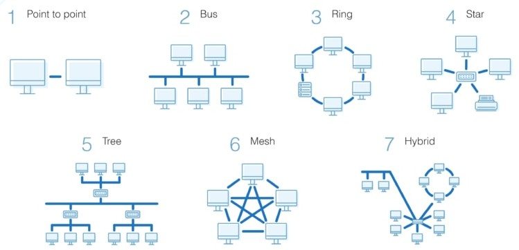
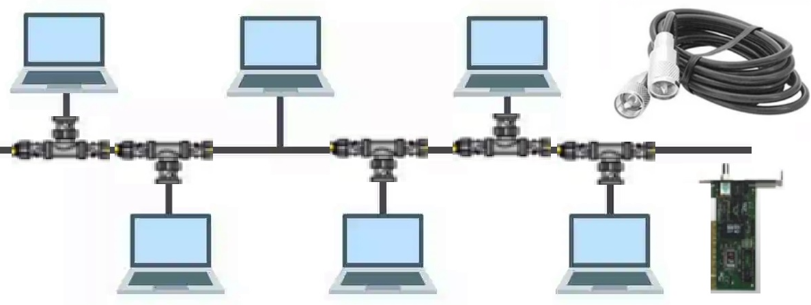
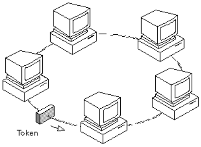
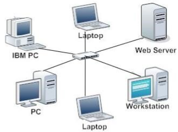
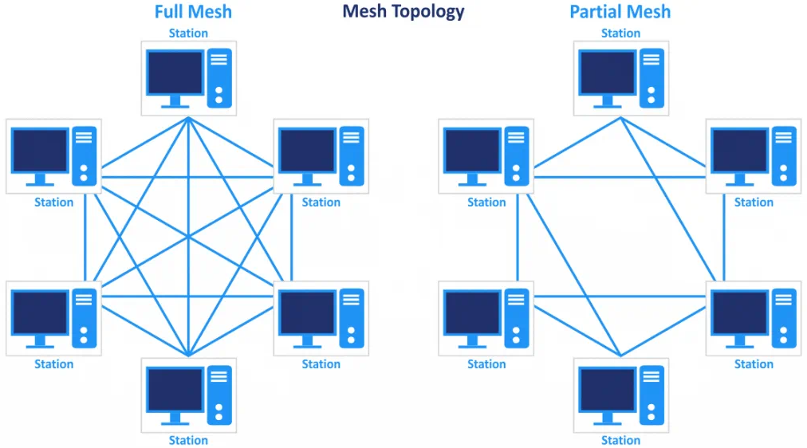
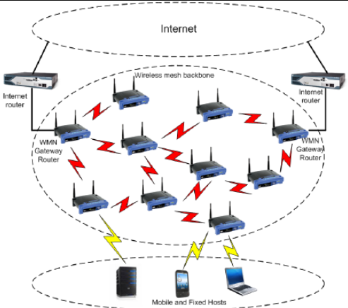

# Ağ Topolojileri

Ağ topolojisi, bir ağı oluşturan cihazların fiziksel ve mantıksal yerleşim biçimidir. Bu bölümde çokça bilinen fiziksel ağ topolojilerini inceleyeceğiz.

  
*Görsel kaynağı: https://www.dnsstuff.com/what-is-network-topology*  

!!! note
    "Ağ topolojisi" kavramını her kullandığımızda, bilgisayar ağlarından bahsettiğimizi unutmayalım. Bilgisayar ağlarının dışında da ağ sistemleri bulunmaktadır ve bunlar farklı topolojiler kullanıyor olabilirler.

## Doğrusal (Bus) Topoloji

Doğrusal bir hat üzerinde bilgisayarların T konnektörlerle bağlanması
şeklinde kurulur. Hattın her iki ucunda sonlandırıcı kullanmak
zorunludur. Koaksiyel kablo kullanılır. Ağın herhangi bir noktasında
arıza olması durumunda ağın tamamı çöker. Ağdaki veri trafiği tüm uçlara
gider. Herkes herkesin trafiğini görebilir. Bu yüzden çok fazla
**çakışma (collision)** olur.

  
*Görsel kaynağı: https://www.lunarcomputercollege.com/computer-network-topologies/*

## Halka (Ring) Topoloji

Doğrusal topolojiye benzer. Sonlandırıcı kullanılmaz. Hattın iki ucu
birleşiktir. Hatta sanal bir jeton dolaşır(token).Jeton sırası gelen
bilgisayar, jeton boş ise göndereceği veriyi hatta yerleştirir. Bilgisayarlar sırayla veri gönderdiklerinden çakışma daha azdır. Günümüzde hiç kullanılmamaktadır. Herkes herkesin verisini kullanabilmektedir.

*Görsel kaynağı: https://www.cse.iitk.ac.in/users/dheeraj/cs425/lec07.html*

## Yıldız (Star) Topoloji

Merkezde dağıtıcı bir cihaz olur. Buradan tüm bilgisayarlara birer kablo
gider. Ağın bir noktasındaki arıza sadece ilgili bilgisayarın ağ
bağlantısına zarar verir. Genellikle **(**bükümlü çift (twisted
pair,xtp)) kullanılır. Trafiğin herkese mi gönderileceği ya da sadece
ilgili uca mı gideceği dağıtıcıya bağlıdır. Dağıtıcının performansı ve
kabiliyeti ağı doğrudan etkiler. Günümüzde en yaygın topolojidir.

*Görsel kaynağı: https://www.researchgate.net/publication/327897159_Hotel_Reservation_System_Based_Local_Area_Network_at_Samarinda*

## Örgü (Mesh) Topoloji

*Görsel kaynağı: https://www.nakivo.com/blog/types-of-network-topology-explained/*

Uçları arasında birden fazla rota üzerinde haberleşme imkanı olan
yapılardır. Günümüzde genellikle farklı yıldız ağlar arasında yedekleme
amacı olarak kullanılır. Bunun dışında kablosuz ağlarda da yaygın olarak kullanılmaktadır.

*Görsel kaynağı: https://www.researchgate.net/publication/234015211_FastM_Design_and_Evaluation_of_a_Fast_Mobility_Mechanism_for_Wireless_Mesh_Networks*