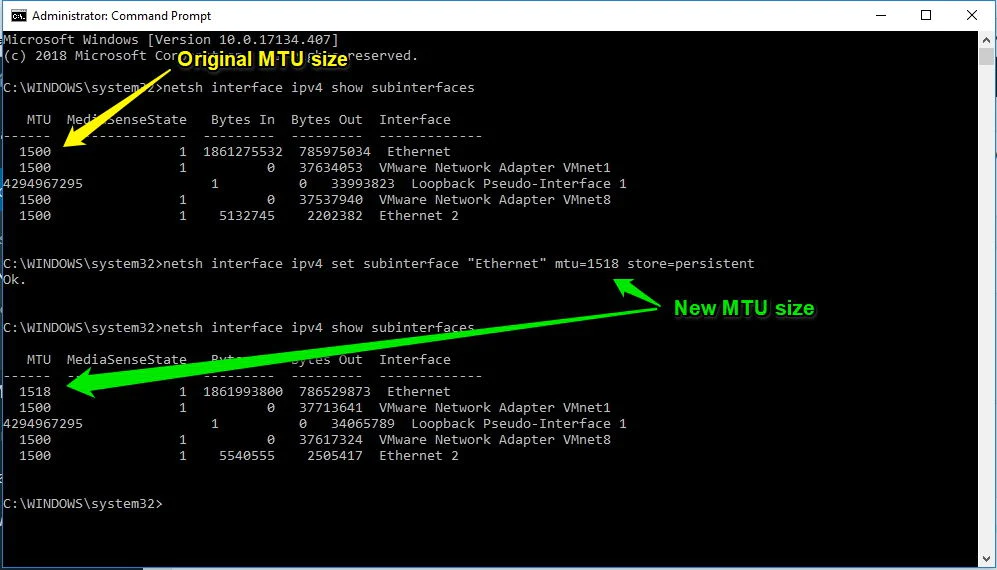
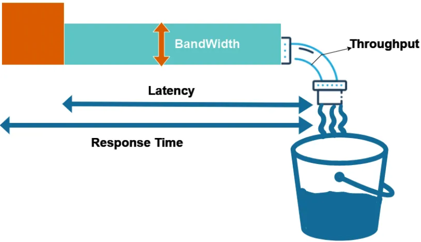
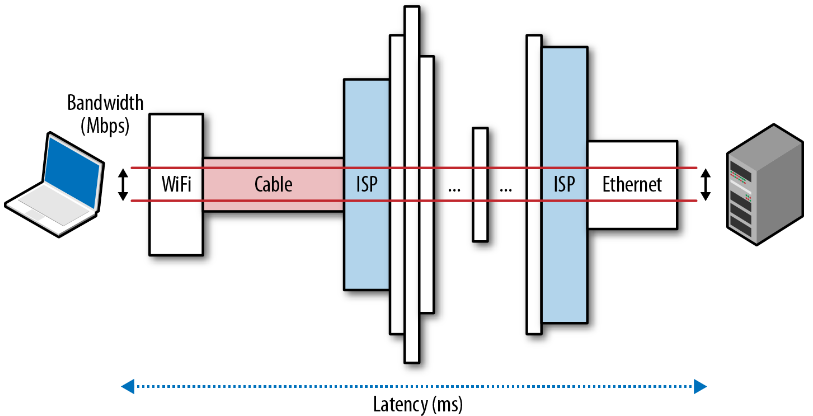
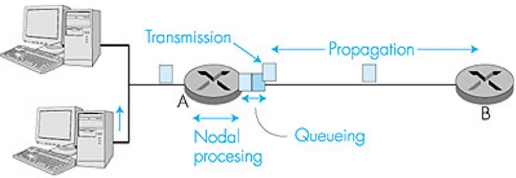
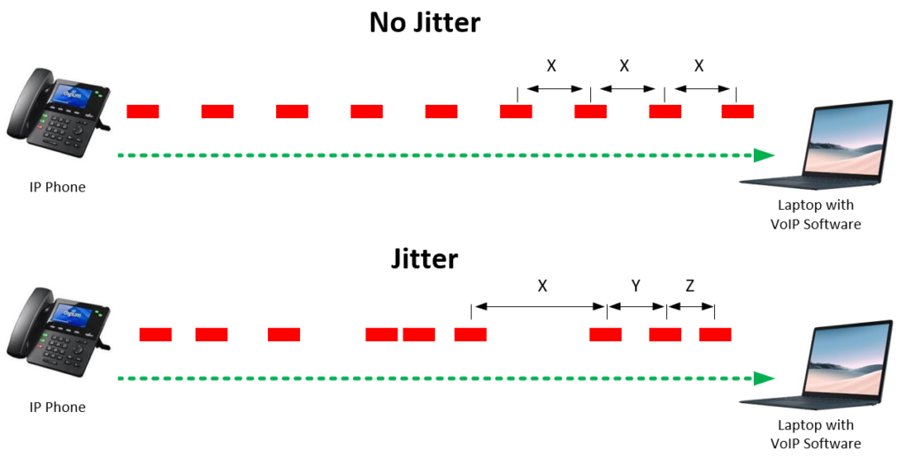
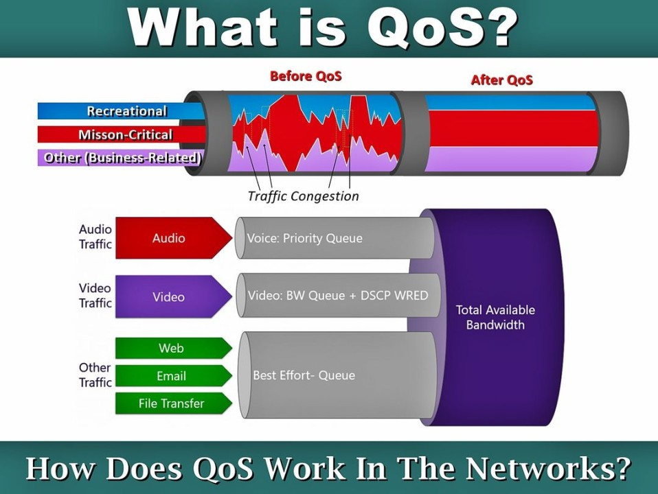
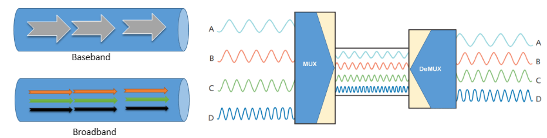
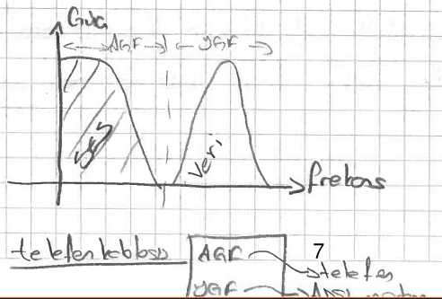

# Temel Kavramlar

## Aktarım Verimliliği

$$ \small{\mathtt{Aktarım \ Verimliliği = {Veri \over (Veri + TCP/UDP \ baslığı + IP \ baslığı + Ethernet \ baslığı)}}} $$

Bu denkleme göre; bir seferde gönderilen veri bloğu ne kadar büyürse, verim o kadar artar.

## MTU

 _Maximum Transmission Unit_. Bir seferde gönderilebilecek maksimum veri miktarını belirler. Ethernet ağlarında MTU değeri varsayılan olarak **1500
bayt/kapsül**
  
*Görsel Kaynağı: <https://info.support.huawei.com/info-finder/encyclopedia/en/MTU.html/>*

  
*Görsel Kaynağı: <https://softkeys.uk/blogs/blog/how-to-check-mtu-size-in-windows-10/>*

## RTT

_Round Trip Time_. Paketlerin karşı tarafa gidip geri gelmesi için geçen süre.

*Linux'ta ping çıktısı*

## TTL

 _Time to Live_. Paketlerin ağda sonsuza kadar dolaşmaması için kullanılan **yaşam süresi**dir. Başlangıç TTL değeri sistemden sisteme değişir. 256, 128 veya 64 olabilmektedir. Bir paket, **hop noktaları** arasında her aktarıldığında **TTL değeri 1 azalır**.
  
*Görsel kaynağı: <https://ipwithease.com/what-is-time-to-live-ttl-in-networking/>*

  
*Zamana Karşı filmindeki insanların TTL değeri*

## Bant Genişliği (Bandwidth)

Haberleşme kanalının veya iletim ortamının kapasitesini ifade etmek için
kullanılır. Analog sinyallerde birini **Hertz (hz)** iken, dijital sistemlerde **bps (b/s)** şeklindedir.  

!!! note
    "Bant genişliği" kavramını otoban yolda şerit sayısı gibi düşünebiliriz. Trafik ne kadar fazla olursa olsun, şerit sayısı arttıkça trafik sorunsuz ilerleyebilir. Bu kavram doğrudan iletimin hızını ifade etmemekte ama dolaylı olarak iletim süresinin kısalmasını sağlamaktadır.  

Bir haberleşme sistemi, gönderici, alıcı ve iletim ortamından oluşur. İletim kapasitesi en küçük olan, bütün sistemin bant genişliği belirler.

**Bant genişliği ile ilgili diğer kavramlar:**

1. Latency (gecikme süresi): Verinin ağ üzerinde aktarımı sırasında geçen süre.
1. Response time (cevap süresi): Bilgisayarların performansı da dahil edilerek cevap almak için geçen toplam süre.
1. Throughput (işlem hacmi): Bant genişliği teorik bir kavram iken, işlem hacmi uygulamada görülen gerçek kapasiteyi ifade eder. Anahtar (switch) cihazlarının da işlem kapasitesi bu kavram ile ifade edilir.

{width="550"}  
*Görsel kaynağı:<https://medium.com/@sandeep15mca/latency-bandwidth-throughput-and-response-time-0ee4d9028277>*

## Gecikme kaynakları

  
*Görsel kaynağı:<https://www.oreilly.com/content/primer-on-latency-and-bandwidth/>*

  
*Gecikme Kaynakları. Görsel kaynağı: <https://medium.com/@ComNetworks2014/computer-networks-traffic-delay-and-throughput-97c1c2820466/>*

!!! question "Örnek Soru"
    240 MB büyüklüğündeki bir MP3 dosyası, görseldeki sistemde 4 dakikada aktarılıyor.

    1. Bu sistemin aktarım kapasitesi (bant genişliği) ne kadardır?
    1. Dosya aktarım hızı b/s cinsinden ne olmuştur?
    1. Aktarılan dosya, MP3 yerine MPG olsaydı ne olurdu?

    {width="400"}

## Jitter

Dilimize _seğirme, sapma_ şeklinde çevrilebilir. Giden veri paketlerinin gecikme sürelerinde farklılık olması durumu. Özellikle canlı anlık iletişimin sağlıksız olmasına sebep olabilir.
{width="650"}  
*Görsel kaynağı: <https://sonary.com/content/jitter-what-it-is-and-how-to-deal-with-it/>*

## QoS - hizmet önceliklendirme

_Quality of Service_. Bant genişliğinin verimli kullanılması için bazı trafik verilerine öncelik vermek için kullanılır. Ambulans önceliği gibi düşünebilirsiniz. Belirli IP adreslerine ya da belirli uygulamalara öncelik verilebilir. Özellikle canlı anlık iletişim sağlayan telefon görüşme uygulamaları gibi durumları önceliklendirmek için kullanılır.
{width="500"}  
*QoS. Görsel kaynağı: <https://www.linkedin.com/pulse/what-qos-saravind-rajan/>*

## Temel Bant ve Geniş Bant

- **Temel bant**(_Base Band_). İletim ortamında tek bir frekans bandı kullanılır. Böylece teorik olarak iletim ortamının tüm kapasitesi tek bir kanal için kullanılır. Ethernet'te temel bant kullanılır.
- **Geniş Bant**  (_Broad band_). İletim ortamında birden fazla frekans bandı kullanılır. bulunur. Basit
bir frekans band filtresi sayesinde kanallar ayrıştırılabilir. Telefon
hattından aynı anda ses verinin taşınması buna örnektir.

  
*Görsel Kaynağı: <https://www.computernetworkingnotes.com/networking-tutorials/differences-between-baseband-and-broadband-explained.html/>*

  
*Geniş bant içindeki farklı verileri ayrıştırma*

## Paralel ve Seri İletişim

Paralel iletişimde byte düzeyinde iletişim sağlanır. İki uç arasında en az 8 tane fiziksel iletim ortamı olmalıdır. Band genişliği teorik olarak 8 hat daha fazla olduğu düşünülebilir. Ancak hem maliyet hem protokol tercihi hem de kullanılan topoloji gibi etkenler bu konuda etkilidir.
  
*Görsel kaynağı: <https://www.digikey.com/en/maker/tutorials/2023/what-is-serial-communication-and-how-does-it-compare-to-parallel>*

!!! question "Araştırma sorusu"
    Paralel iletişim daha hızlı olmasına rağmen neden günümüzde hala bazı yerlerde seri iletişim kullanılıyor? Gündelik hayatımızda bilgisayar kullanırken nerelerde seri iletişim kuruyoruz?

## Haberleşme Kanalı Modları

1. **Simplex Kanal**: Televizyon ve radyo gibi yayının tek taraflı olarak yapıldığı kanallardır.
2. **Half-dubleks Kanal**: Çift yönlü iletişim vardır. Ancak aynı anda sadece bir taraf veri gönderebilir. **telsiz** gibi.
3. **Full-dupleks Kanal**: İki uç arasında iki tane simplex kanal vardır. Böylece aynı anda iki taraf veri gönderebilir ve alabilir. Örnek **telefon görüşmeleri**.

Günümüzde tüm bilgisayar ağları **full-dupleks**’tir.
  
*Görsel kaynağı: <https://www.blackbox.co.uk/gb-gb/page/25069/Resources/Technical-Resources/Black-Box-Explains/Fibre-Optic-Cable/Simplex-vs-duplex-fiber-patch-cable/>*
