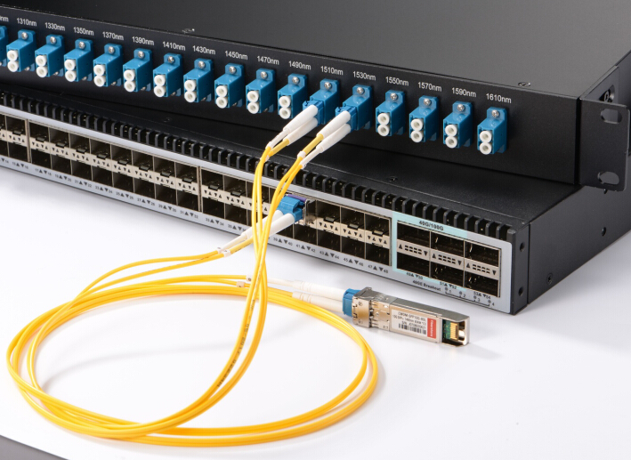

# İletim Ortamları

Temelde **atmosfer** ve **kablo** olmak üzere iki farklı iletim ortamı
mevcuttur. Atmosferde RF (radyo frekans) dalgalarını kullanarak iletişim
gerçekleşir. Kablolarda ise genellikle **fiberoptik** ve **bakır** kablo
kullanılmaktadır.

İnternet yaygınlaşmaya başladığında, dünyadaki her eve kablo çekmek mümkün olmadığından, mevcut altyapılardan nasıl yararlanılacağına çalışıldı. Her eve gidebilecek en kolay yöntem telefon hattı olduğundan ilk İnternet bağlantıları telefon hattı üzerinden sağlandı. Eskiden telefon hattı üzerinden internet hizmeti de kullanmaya çalışırken, şimdi internet altyapısı üzerinden -_ihtiyaç olursa_- telefon hizmeti de kullanabiliyoruz.

## İki Telli Bakır Telefon Hattı

Telefon iletişimini sağlamak için tasarlanmıştır. İnternet'te yaygın kullanılan ilk kablo türüdür. Temel bant ve geniş bant internet hizmeti verilmektedir. Analog modülasyon teknikleriyle en fazla 56 Kb/s’lik band genişliği sağlar. xDSL teknolojileriyle teorik olarak 400 Mb/s’lik bant genişliğine ulaşılmaktadır.

  
*Görsel kaynağı: <https://www.geeksforgeeks.org/types-of-internet-connection/>*

## Koaksiyel (Coaxial) Kablo

Genellikle elektriksel gürültünün yoğun olduğu şartlarda kullanılırdı.Yalıtkan bir tüpün içerisinde giden bir tel ve tüpün dışına sarılmış kafes şeklinde teller vardır. Yerel ağlarda (LAN) 180m’de(max) 10M b/s bant genişliği sağlar. Bu kullanımı 10 Base 2 olarak bilinir. Daha sonra 500 m mesafede çalıştırılacak hale getirilir. 10 Base 2 ismiyle standartlaştırılmıştır. 50 ohm’luk direnç değeri vardır. BNC tarzında konnektörler kullanılır. Günümüzde LAN’da hiç
kullanılmamaktadır. Sebebi hem 10 Mb/s hızının çok düşük olması, hem de
UTP kablolar kadar ekonomik ve işlevsel olmamasıdır. Bilgisayar ağlarında doğrusal (bus) topolojilerde kullanılmıştır.

  
*Görsel kaynağı: <https://www.wiremasters.com/newshub/news/the-ins-and-outs-of-coaxial-cable>*

  
*BNC Konnektörler*

## Bükümlü Çift Kablo (Twisted Pair Cable)

İçerisinde bükülmüş çiftler halinde bakır tel bulunur. Kabloların birbirleri üzerindeki direnç elektromanyetik etkisini azaltmak için ikişerli olarak sarılı durumundadırlar. 
  
*Bükümlü çift kablo*

  
*Görsel kaynağı: <https://www.linx-com.com/copper-construction/>*

- U: Unshilded (Korumasız)
- F: Foiled (Folyolu)
- S: Shielded (Korumalı)

### Frekanslarına Göre xTP kablolar

  
*Görsel kaynağı: <https://dc.mynetworkinsights.com/categories-of-copper-twisted-pair-cables/>*

{ width="800" }  
*Görsel kaynağı: <https://telecom.samm.com/history-of-ethernet-lan-cables-categories>*

!!! warning "CAT-1, CAT-2, CAT-3"
    Telefon hatlarında kullanılır, ağlarda kullanılmaz.  

{ width="800" }  
*Görsel kaynağı: <https://www.electricalvolt.com/how-to-crimp-rj45-connector/>*

Bükümlü çift CAT5 VE CAT6 Kabloları sonlandırmak için RJ-45 adı verilen
konnektörler kullanılır. Bu kablolar iki farklı iki şekilde
sonlandırılabilir.**568-A,568-B**  
Kablonun iki ucunun aynı standartlarla sonlandırılmasına **düz (Straight
kablo)** denir. İki ucunda iki farklı standartta sonlandırılma yapılırsa
**çapraz(cross-over)kablo** adı verilir.

### Ethernet Kablosunda Pin Dizilimi

  
*Görsel kaynağı: <https://resources.altium.com/p/gigabit-ethernet-101-basics-implementation/>*

### Çapraz ve Düz Kablo

Bilgisayar ile dağıtıcı cihazların (anahtar, hub) iletişim kurabilmesi için; Bilgisayarın TX (Transmit) hattına karşılık anahtarın RX (Receive) hattı denk gelmelidir. Dağıtıcı olan ve olmayan cihazların pinleri karşılıklı denk gelecek şekilde (TX <-> RX) tasarlanmıştır. Ancak aynı türde iki cihaz birbirine bağlanırsa o zaman TX-TX ve RX-RX portlar karşılıklı gelmiş olur. Bu durumda çapraz (Crossover) kablo kullanılır.

  
*Çapraz kablo ne zaman kullanılır?*

  
*FastEthernet çapraz kablosu. Görsel kaynağı: <https://www.youtube.com/watch?v=WSIuPM4q5Tw/>*

!!! note "Auto-MDI-X"
    Yeni ağ cihazlarının tamamı Auto-MDI-X adı verilen teknoloji sayesinde
    karşıdaki cihazın ne tarz bir cihaz olduğunu anlar ve hangi pin'in ne
    amaçla kullanılacağını buna göre düzenler.

#### Örnek

Görsel, Cisco Packet Tracer uygulamasında oluşturulmuştur. Kesikli çizgiler çapraz kabloyu temsil eder. Düz çizgi de düz kabloyu temsil eder.  
  
*Çapraz kablo kullanım yerleri (örnek)*

## Fiberoptik Kablolar

Işığın cam bir tüp içinde iletilmesi şeklinde çalışır. Veri optik dalgalar arıcılığı ile ışığın yansıma kurallarına göre iletilir. Elektriksel sinyallere kıyasla, sinyalin mesafeye bağlı zayıflama ve kayıpları çok azdır. Bakır kablolarda zorunlu olan _gerilim farkından kaynaklanan topraklama ihtiyacı_ yoktur.

Verici tarafından ışık kaynağı olarak lazer diyot(led), alıcı tarafında ise fotodiyot ya da foto transistör gibi elektronik elemanlar kullanılır.

 Uzak mesafelerde veri iletişimi konusunda fiberoptik kablo dışında Wifi ve uydu iletişimi gibi seçenekler de bulunmaktadır. Ancak en sağlam ve ucuz seçenek fiberoptik kablolardır.

  
*Görsel kaynağı: <https://www.researchgate.net/publication/325386764_Optical_Fiber_Sensor_Review_and_Applications/>*

### Fiberoptik kablo avantajları

1. **Yüksek hız ve bant genişliği**: Fiber optik kablolar, geleneksel metal iletişim hatlarına göre daha yüksek bant genişliği sağlar. Bu sayede hızlı ve verimli veri aktarımı mümkün olur.
1. **Daha az sinyal zayıflaması**: Optik fiberdeki sinyal kaybı bakır tellere göre daha azdır. Bu nedenle daha uzun mesafelerde veri iletimi sağlanabilir.
1. **Daha az elektromanyetik girişim (EMI)**: Fiber optik kablolar, elektromanyetik girişime karşı daha az duyarlıdır ve daha güvenilirdir.
1. **İnce ve hafif**: Fiber optik kablolar, bakır kablolar gibi kalın ve ağır değildir. Bu özellikleri sayesinde kurulum ve bakım işlemleri daha kolaydır.
1. **Dış ortam koşullarına dayanıklı**: Sıcaklık değişimleri, su baskınları, şiddetli hava ve nem gibi çevresel parametrelere karşı dayanıklıdır.
1. **Güvenli**: Elektromanyetik enerji sızması meydana gelmediği için bilgi güvenliği de sağlanmış olur. Kötü kişilerin araya girmesi, bakırdaki kadar kolay değildir.

  
*Görsel kaynağı: <https://he.aliexpress.com/item/1005005348057886.html/>*

### Fiberoptik kablo dezavantajları

1. **Kırılganlık** - Fiber optik, bakır tellere kıyasla daha kırılgandır ve
hasara karşı daha hassastır. Fiber optik kabloları bükmemeli veya
bükmemelisiniz.
1. **Pahalı**. Yerel ağlarda, bakır kablolar ve ekipmanlarına göre maliyetli olmaktadır.

  
*Görsel kaynağı: <https://www.amazon.in/3D-Cloud-Plastic-Connector-Equipment/dp/B07SZFLHB1/>*

### Fiberoptik kablo türleri

Işık ileten tüpün çapına göre; Single Mod(SM) ve Multi Mod(MM) olmak üzere ikiye ayrılır:
  
*Görsel kaynağı: <https://learn.aflglobal.com/enterprise/single-mode-vs-multimode/>*

**Multi-Mode**: Bina ya da kampüs içi kısa mesafelerde tercih edilir. Verici ve alıcı maliyetleri single moda göre yarı yarıya azdır.

**Single-Mode**: Daha uzun mesafelerde daha yüksek bant genişliğine imkan sağlar. Verici ve alıcı donanım maliyetleri daha fazladır.

  
*Görsel kaynağı: <https://fukuoka-ken-ken.co.jp/multi-mode-optical-fiber-k.html>*

### Fiberoptik çeviriciler

Fiberoptik kablodan gelen ışık sinyallerinin bakır yerel ağlarda kullanılabilmesi için elektriksel sinyallere dönüştürülmesini sağlar. Günümüzde, SFP adı verilen küçük tipte çeviriciler kullanılmaktadır.   
  
*Görsel kaynağı: <https://salepubsm.live/product_details/37305281.html/>*

SFP'ler, switch'lere takılarak kullanılır. Kullanılan çeviriciye göre bağlantının bant genişliği belirlenir. Fiberoptik çeviriciler için kullanılan diğer isimler şöyle sıralanabilir:

- F/O converter 
- F/O transceiver (transmitter & receiver)
- GBIC. _Gigabit Interface Connector_. Switch modülü halinde olur.
- SFP. _Small Form-factor Pluggable Module_. Switch modülü halinde olur. Bakır ve fiber için SFP'ler bulunmaktadır.
  
*Görsel kaynağı: <https://www.qsfptek.com/qt-news/sfp-module-introduction-sfp-meaning-fiber-sfp-and-copper-sfp/>*

### Ekleme ve test işlemleri

*Fiberoptik kablo ek (füzyon) işlemi. Görsel kaynağı: <https://www.tehencom.com/fiber-optic-fusion-splicers/fujikura-42s-standard>*
  

*Fiberoptik kablo ek (füzyon) işlemi. Görsel kaynağı: <https://www.tehencom.com/fiber-optic-fusion-splicers/fujikura-42s-standard>*

*F/O kablo testleri "OTDR" isimli cihaz ile yapılır. Görsel: <https://en.wikipedia.org/wiki/Optical_time-domain_reflectometer>*
