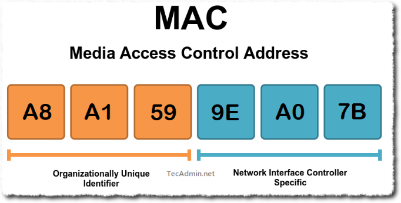
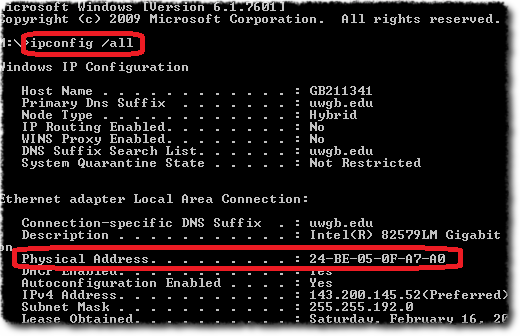
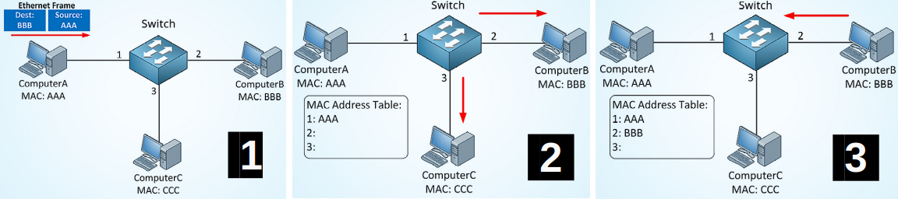
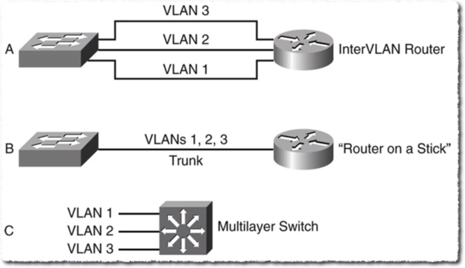
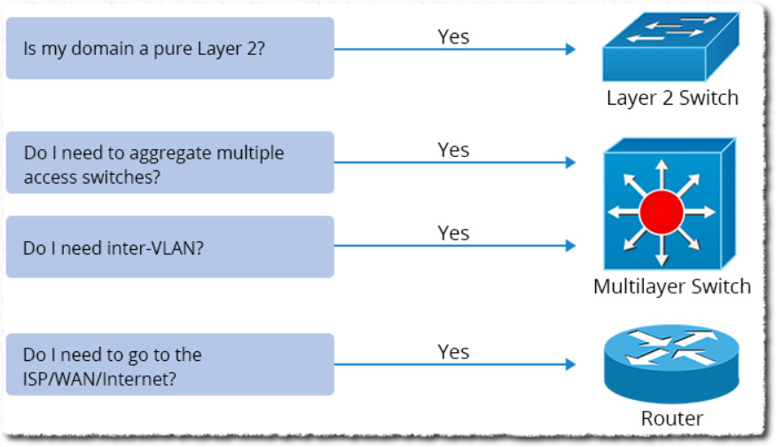
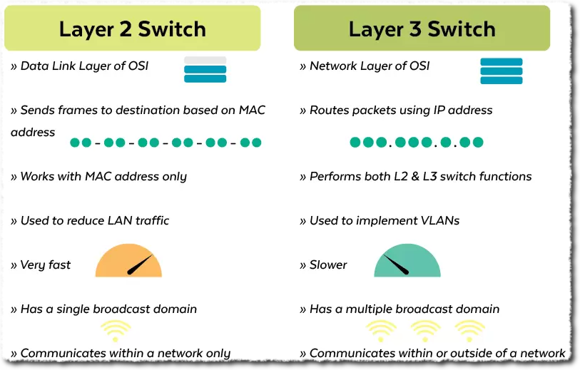
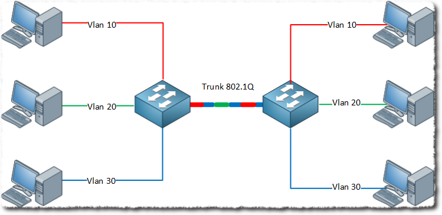
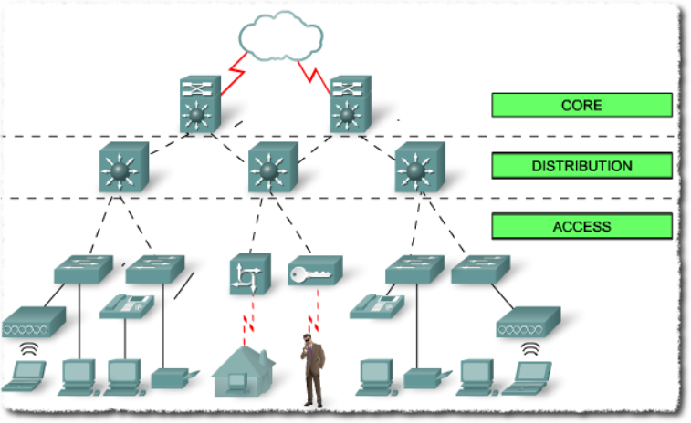
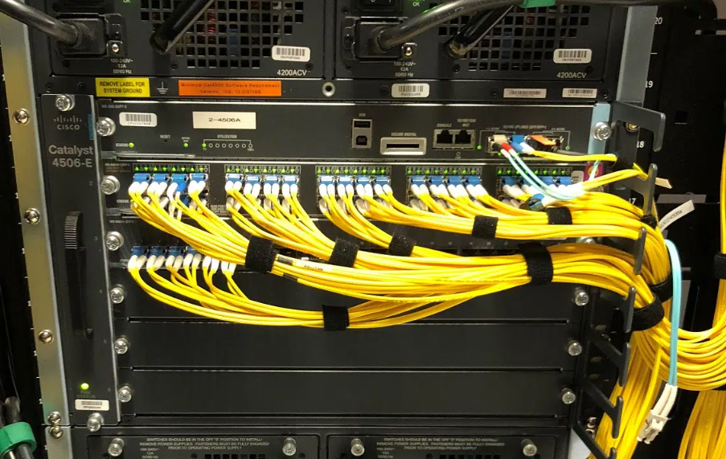
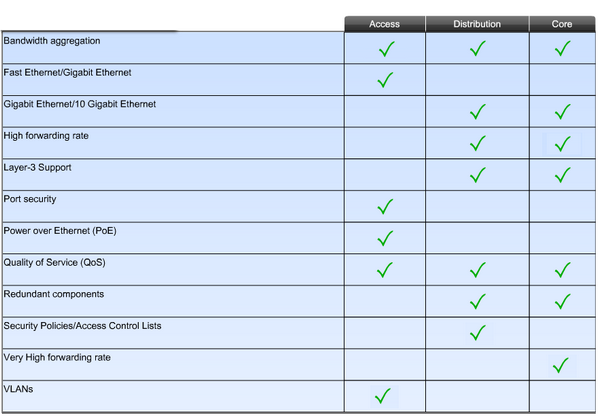

# Yerel Ağlar - LAN/VLAN
Yerel ağlarda haberleşmeyi sağlayan ethernet çerçevesinde(frame) 48
bitlik adres kullanılır. MAC adresi 16’lık sayı sisteminde 12 tane
karakter ile gösterilir.
  
*Görsel kaynağı: https://tecadmin.net/media-access-control-address/*

İlk 6 karakter (ilk 24 bit) üretici kodunu (OUI), son 6 karakter ise seri
numarasını belirtir. Bir üretici aynı MAC adresini birden fazla karta
veremez. Dolayısıyla -_teorik olarak_- MAC adresleri dünyada tektir (_uniq_). 

!!! warning "Dikkat"
    Birden fazla aynı MAC adresi aynı ağ üzerinde (LAN / VLAN) olmamalıdır.

  
*Görsel kaynağı: https://uknowit.uwgb.edu/page.php?id=28810/

## ARP
"Adres Çözümleme Protokolü" anlamındadır. İkinci katmanda çalışır. Ağdaki Bilgisayarların MAC adreslerini öğrenmek ve bu cihazdaki ARP tablosunu güncellemek en temel görevidir.

Ağa yeni bağlanan cihaz IP adresi henüz olmadığından yayın mesajı göndererek IP adresi ister. Anahtarlarda tutulan IP ve MAC adreslerinin tablosuna "ARP tablosu" denir. ARP Tablosu dinamik olarak güncellenir ancak istenirse elle düzenleme ya da statik kayıt işlemi yapılabilir.

  
*Görsel kaynağı: https://community.fs.com/article/switch-mac-address-whats-it-and-how-does-it-work.html*

!!! Question "Soru"
    ARP tablosunda "statik kayıt ekleme özelliği" ne işe yarar?

## Yayın Adresi (Broadcast Address)
Tüm yerel ağı temsil eden adrese **yayın adresi** denir. Bu adrese gönderilen veri, ağdaki tüm cihazlara aynı anda ulaştırılır. İkinci veya üçüncü katmanda yayın mesajı gönderilebilir.
  
İkinci katmanda yayın adresi göndermek için çerçevedeki hedef MAC adresi kısmında tüm bitler 1 yapılır. Dolayısıyla hedef adresi FF:FF:FF:FF:FF:FF olmuş olur.

## Yayın Alanı
Bilgisayarların doğrudan MAC adresleriyle haberleştikleri alandır. Bir yayın paketi gönderildiğinde, bunu alabilen tüm cihazlar aynı yayın alanındadır.

!!! note "Yayın alanı, ağ geçidinde biter"
    Bir bilgisayar kendi yayın alanında olmayan başka bir bilgisayarla  haberleşmek için "ağ geçidinden" geçmek zorundadır.

## Çarpışma Alanı
Bir yayın alanı içerisinde bir veya birden fazla çarpışma alanı bulunabilir.Aynı çarpışma alanındaki bilgisayarlar birbirine gelen her paketi görürler,ancak sadece kendi mac adreslerine gelen her paketi alırlar. Çarpışma alanı aynı anda sadece bir pc tarafından kullanılabilir. İki PC aynı anda paket göndermek isterse çarpışma(collision) oluşur. Adını buradan alır.

!!! note "Çarpışma alanı"
    Çarpışma alanı istenmeyen bir durumdur. HUB'lar çarpışma alanına sebep olur.

<figure>

<figcaption aria-hidden="true">Soru1</figcaption>
</figure>

1)Kaç tane yayın alanı vardır? 2  
2)Kaç tane çarpışma alanı vardır? 3  
3)Her çarpışma alanında kaç tane bilgisayar vardır?  
4)Her yayın alanında kaç tane bilgisayar vardır?  
Birinci yayın alanında 3 tane  
İkinci yayın alanında 8 tane  
\*YAYIN ALANI:mecburen ağ geçidi kullanılır.  
\*ÇARPIŞMA ALANI:Birbirlerinin verisini görecekler.

<figure>

<figcaption aria-hidden="true">Soru2</figcaption>
</figure>

A ile B aynı anda paket gönderebilir mi? Yaçarpışma olur ya da sıra  
B ile C aynı anda paket gönderebilir mi?  
B ile C aynı Pc gönderirse olur,ancak farklı olursa aralarındaki
topolojileri bilmediğimiz için bilemeyiz.  
C yayın mesajı gönderdiğinde tüm pc’lere gider mi?  
Evet tüm Pclere gider.  
B ile C aynı arasındaki trafiği F görür mü?  
Normal zamanda göremez.Ancak örneğin aynalama gibi işlemerde
görebilir.  
Anahtar üzerinde pc’lerin haricinde dış dünya ile iletişim kurmak için
bağlantı yapılan porta "upink" poru denir. Anahtarın bilgisayara
bağlanan normal portlarına(bakır portlara 45 port) "giriş portu"
denir.Genel olarak 100mb/s-1000mb/s olurken "uplink portları" genellikle
daha kapasiteli olur. Anahtarları birbirinden ayıran bir diğer özellikte
"demir gücü kapasitesi"anahtarın aynı anda çevirebileceği trafik
miktarına "switchfabric" ya da "through put"denir.

## Ağ Geçidi (gateway)
Bir ağdaki bilgisayarlar, kendi ağı dışındaki ağlara gidebilmek için ağ geçidinden geçmek zorundadır. Başka bir deyişle; "ağ geçidi, bir ağın dışarı açılan kapısıdır". Sıradan bir PC, 3.katman(L3) anahtar, yönlendirici veya özel üretilmiş donanımlar ağ geçidi görevi yapabilir. Hatta cep telefonumuzun internet bağlantısını bilgisayarımıza paylaştırdığımızda, cep telefonumuz, bilgisayar için bir "ağ geçidi" olmaktadır.

Bazı ağ geçitleri, üzerindeki ağ arayüzüne(interface) bağlı olarak ethernet, Frame Relay, ATM, PPPoE gibi protokolleri kullanılabilme özelliğine sahip olduğundan bazı kaynaklarda _protokol çevirici_ olarak adlandırılır.

Önceden bahsedildiği gibi, anahtarlar çarpışma alanını geçirmezler ancak yayın trafiğini geçirirler. Bünyesinde çok fazla anahtar (çok faza bilgisayar) bulunan yerel ağlarda yayın paketlerin çokluğu, ağı hantallaştırabilir. Bu nedenle LAN’ları birden fazla alt ağlara bölmek performansı arttıracaktır.

**Örnek yayın mesajları:**  
- IPV4 İIPV6 mesajları  
- Komşuluk mesajları  
- Donanım keşif mesajları  
- Ip alma (DHCP)mesajları  
- Virüs (solucan) gibi kötü yazılımlar  

## Alt Ağa Bölme Yöntemleri 
**Klasik yöntem**de her bir ağ için bir fiziksel bir ağ geçidi kullanılması zorunludur. Dolayısıyla cihazların ve iletim ortamlarının sınırları en önemli kısıtlardır.

Bir **VLAN yapısı**nda ise fiziksel bir müdahale olmadan, hatta uzaktan bağlanarak ağ istenilen şekilde özelleştirilebilir.

**Sanal ağ kullanmanın avantajları**
- Farklı anahtarlar üzerindeki bilgisayarlar aynı ağda olabilir.
- Aynı anahtarda birden fazla farklı ağ (VLAN) olabilir.
- Ağlarda değişiklik yapmak için fiziksel değişiklik yapmaya gerek yoktur. Uzaktan dahi kolayca yapılabilir.

## Ağları bölmenin faydaları
1. **İşletme Kolaylığı**: Ağlar küçük olduğunda sorunu çözmek
    kolaylaşır. Ağ isimleri, IP grupları ve kullanım yerleri eşleştirilerek hiyerarşik sistemler oluşturulabilir. 
2. **PC sayısını azaltmak**: Her bir ağdaki pc sayısını azaltarak yayın
    alanını daraltmak, fazlalık yayın mesajlarını azaltmak ve performansı arttırmak
3. **Güvenlik**: Birbirine erişimi kısıtlamaması gereken ağlar arasında
    erişim denetim listeleri (Access Control List ~ ACL) oluşturularak
    erişim kısıtlanabilir.
---

**Esneklik**: Eğer ağı VLAN ile bölersek; farklı coğrafyadaki bilgisayarlar aynı VLAN'da olabilir ya da aynı anahtar üzerinde birden fazla farklı VLAN olabilir.

<figure>

<figcaption aria-hidden="true">LAN-VLAN</figcaption>
</figure>

## VLAN Anahtarlar
Üzerinde sanal ağlar tanımlanabilen anahtarlardır. Aynı zamanda ayarlanabilir anahtarlardır. Bu nedenle yönetilebilir anahtarlar da denmektedir. VLAN anahtarın üzerindeki portlar gruplandırılarak birden çok sanal ağ oluşturulabilir.
  
*Görsel kaynağı: https://www.practicalnetworking.net/stand-alone/routing-between-vlans/*

Her bir sanal anahtar, ayrı bir ağ gibi çalıştırılabilir. Bu sanal ağlara "VLAN" (Virtual LAN ~ Sanal Ağ) denir. Her bir VLAN’ın kendine özel VLAN-ID  isminde bir tanımlayıcı numarası olur. Anahtarların fiziksel portları, VLAN ID’ler ile eşleştirilerek ağlar düzenlenir.

!!! info
    Aynı VLAN numarasına sahip portlar aynı sanal ağa aittir.

Bazı durumlarda VLAN yapılandırılması portlardan ve fiziksel bağlantılardan bağımsız olarak yapılabilir. Örneğin PC’nin MAC adreslerine göre ya da kullanıcı kimlik doğrulama yöntemine göre (parola, parmak izi, vb.) VLAN ataması yapılabilir. VLAN anahtarlar üzerinde birden fazla sanal ağ oluşturulursa bu alt ağlar arasında trafiğin yönlendirilmesi gerekmektedir. Bu yönlendirme işlemi anahtarın kendi üzerinde veya ayrı bir yönlendirici cihazla yapmak mümkündür.

  
*Görsel kaynağı: https://www.youtube.com/watch?v=SPloaasxkMQ*

  
*Görsel kaynağı: https://www.qsfptek.com/qt-news/how-to-choose-best-aggregation-switch.html*

Anahtar üzerinde yönlendirme yapılacaksa 3 katmanda(L3) çakıştırılacak
bir anahtar kullanılmalıdır.
  
*Görsel kaynağı: https://planetechusa.com/layer-2-vs-layer-3-switches

## IEEE 8021.Q VLAN protokolü
**Dot1q** olarak ta bilinir. Ethernet protokolü ilk tasarlandığında VLAN ihtiyacı yoktu. 1998 yılında yayınlanan 802.1q protokolü ile Ethernet protokolü VLAN farkındalığı kazandı.
  
*Görsel kaynağı: https://www.ictshore.com/free-ccna-course/vlans-configuration-cisco-switch/*

**trunk (tagged) port:** Anahtarın herhangi bir portundan birden fazla VLAN taşınması gerekiyorsa o port trunk olarak yapılandırılmalıdır. Aynı zamanda bu bağlantıya da "trunk" denir. Genellikle iki anahtar arasında kullanılır ancak ihtiyaca göre 1 bilgisayara bile trunk bağlantı verilebilir. Anahtarlar, bu portta gelen-giden trafiklere bakarak başlık bilgisindeki trafiğin ilgili VLAN'a gitmesini sağlar.

**acces (untagged) port:** Bu portta VLAN etiketleri olmaz. Anahtar üzerinde config yapılarak, bu porttan gelen-giden tüm trafiğin belirli bir VLAN'a gitmesi sağlanır.
  
*Görsel kaynağı: https://networklessons.com/switching/802-1q-encapsulation-explained*

Cisco firması `trunk/access` sözcüklerini kullanırken diğer üreticiler genellikle `tagged/untagged` sözcüklerini tercih etmektedir.

## Anahtar Kullanım Mimarisi
  
*Görsel kaynağı: https://blog.router-switch.com/2014/04/network-design-with-examples-core-and-distribution/*

1. **OMURGA(CORE)**  
Üçüncü katman veya daha üstü anahtar kullanılır.Genellikle tüm Vlanlar
burda oluşturulur.Ağın tüm yönlendirme yükü bunun üzerindedir.Bu nedenle
genellikle yedekli kullanır.Performansı çok fazladır.Binalar arası
bağlantıyı sağlamak için kullanılır.Bu nedenle çok sayıda fiberoptik
port sergilerler.Modüler yapıdadırlar,yani port sayıları ve türleri
modüler halinde takılıp çıkartılabilir.Modülerin takıldığı yere "şase"
denir.Fiziksel olarak çok yer kaplarlar ve pahalıdırlar.  
  
*Görsel kaynağı: https://thenetworkinstallers.com/blog/fiber-optic-installation-process/*

2. **Dağıtım(Distrubution)Katmanı**  
Omurga anahtarında bağlı olan ve binaların içerisinde küçük bir omurga
gibi düşünebileceğimiz anahtarlardır.Omurga anahtarına göre daha
ucuzdur.L2 veya L3 olabilir.  

3. **KENAR**  
Son kullanıcı cihazlarının bağlandığı anahtarlardır.Bu nedenle
özel görevleri olabilir.  
İhtiyaca göre :  
802.1x(Kimlik Doğrulama)  
PoE(802.3aaf) Enerji göndermek için kullanılır.  
Captive Portal

  
*Görsel kaynağı: https://blog.router-switch.com/2014/04/network-design-with-examples-core-and-distribution/*

**Örnek:**  
20 portlu bir VLAN anahtar 4 portlu bir ağ geçidine
bağlanabiliyorAşağıdaki durumları yorumlayınız. 

1)Her portun port sayısı 5’er tanedir.  
Böyle bir zorunluluk yoktu.̊  
2)Bir valan anahtar üzerine doğrudan bağlanacak PC sayısı 16’dır  
16 tane de olabilir daha fazla da olabilir.  
3)Her vlana atanmış portlar ardışık olmak zorundadır  
Öyle bir şey yok.Esneklik özelliği vardır .
