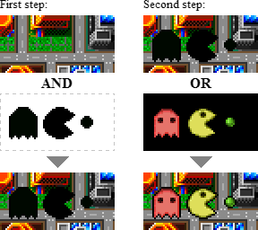

# İnternet'in Protokolü: IP
Bu bölümdeki içeriği anlattığım bir video var. Alt ağlara bölme konusuna kadar anlatmıştım. İsteyenler videodan da faydalanabilir:

## Genel Bilgiler
{width="300"}   

IPv4 adresleri tükendiği için, artık IPv6 adresleri dağıtılmaktadır. Uzunca bir süre daha ikisini birlikte kullanmak zorundayız.

IPv4 adresleme sisteminde $2^{32}$ IP adresi kullanılabilirken, IPv6 adreslemesinde $2^{128}$ adet IP adresi kullanılabilmektedir. Aşağıda bu iki sayı açık olarak yazılmıştır:

- **IPv4 adres sayısı**: $4.294.967.296$ (yaklaşık 4,3 milyar)
- **IPv6 adres sayısı**: $340.282.366.920.938.463.463.374.607.431.768.211.456$

**Bu ders içerisinde IP ifadesi her kullanıldığında, IPv4 anlaşılmalıdır.** Bu ders açısından ikisi arasındaki en önemli fark; birisinin 32, diğerinin ise 128 bit olmasıdır. IP hesaplamaları tamamen aynıdır. Hesap mantığını anlamak için v4 hesapları -*kısa olduğu için*- daha iyi olacaktır. Sonrasında aynı hesapları v6'da da yapabilirsiniz.

### IANA: IP Dağıtan Kuruluş
https://www.iana.org/ web sitesinde faaliyetleri hakkında bilgi alınabilir.

  
*IANA tarafından yetkilendirilen bölgesel internet kayıtçıları (RIR)*

IANA, IP adreslerini /8 şeklinde RIR'lara dağıttı.
  
*Görsel kaynağı: https://www.iana.org/assignments/ipv4-address-space/ipv4-address-space.xhtml*

IANA elindeki tüm IPv4 adresleri 2011'de bitti.
  
*Görsel kaynağı: https://en.wikipedia.org/wiki/IPv4_address_exhaustion*

### IP Sınıfları
IP'nin ilk tasarlandığı sıralarda ortaya çıkmış bir kavramdır.
Kurumlarda IP adresleri tahsis edilirken ihtiyaca göre optimal sayıda
IP  adresi verebilmek için tasarlanmıştır. En büyük IP sınıfı A sınıfı olanlar, en küçük IP sınıfı da C sınıfı olanlardır.

!!! info "Güncel bilgi"
    Günümüzde IP sınıfları bu anlamın yanında, ağın büyüklüğünü ifade etmek için kullanılmaktadır.

  
*Görsel kaynağı: https://medium.com/networks-security/tricks-to-remember-five-classes-of-ipv4-484c191678fb*
<!---
**A sınıfı:** İlk biti 0'dır. İlk oktet **0-127** arasında olur. Varsayılan ağ maskesi **255.0.0.0**'dır. A sınıfı bir IP adresinde $2^{24}$ tane IP oluşturulabilir.
- **B sınıfı:** İlk iki biti 10 şeklindedir. Ondalık formda ilk
okteti **128-191** şeklindedir. Varsayılan alt ağ maskesi
**255.255.0.0**'dır. B sınıfı bir IP adresinde $2^{16}$ tane IP
oluşturulabilir.
- **C sınıfı:** İlk üç biti 110 şeklindedir. Ondalık formda ilk
okteti **192-223** arasındaki adreslerdir. Varsayılan alt ağ maskesi
**255.255.255.0**'dır. B sınıfı bir IP adresinde $2^{8}$ tane IP
oluşturulabilir.
- **D sınıfı:** İlk dört biti 1110'dır. Ondalık formda ilk
okteti **224-239** arasındadır. **Multicast** (Çoklu yayın) olarak
bilinir. Normalde hostlarda kullanılmaz.
- **E sınıfı:** İlk okteti, **240-248** ile başlar. Deneysel amaçlar için rezerve edilmiştir. Normalde hostlarda ve ağlarda kullanılmaz.
-->
{width="700"}  
*Görsel kaynağı: https://www.routerfreak.com/definitive-guide-ip-address-classes/*

**Örnekler:**

- **BŞEÜ**: `79.123.224.15` A sınıfı olduğu için, bu IP'nin dahil olduğu ağda $2^{24}$ (~16M) tane IP olabilir.
- **ODTÜ**: `144.122.145.153` IP adresi B sınıfıdır. Bu IP'nin dahil olduğu ağda, $2^{16}$ (~65K) tane IP olabilir.
- **SAÜ**: `193.140.253.240` IP adresi C sınıfıdır. Bu IP'nimn dahil olduğu ağda $2^8$ (256) tane IP olabilir.

!!! warn "IP sınıflarının günümüzdeki anlamı"
    İlk başta IP adresleri dağıtılırken kolaylık olsun diye tasarlanmış olan IP sınıfları günümüzde bu anlamda kullanılmamaktadır. BŞEÜ'de 16M IP adresi yoktur. SAÜ'de de C sınıfından (256) daha fazla IP adresi vardır. Örneklerden sadece ODTÜ'nünki gerçekten B sınıfı olarak (~65K) tahsis edilmiştir.

### Özel ve genel IP Adresleri (Private & public IP Blocks)

Özel (private) IP adresleri, İnternet'te kullanılmayan IP adresleridir. Bu nedenle _sanal IP adresi_ de denir. İnternet üzerinde hiçbir yönlendirici tarafından iletilmezler. Bu adreslerin kullanım amacı, test uygulamaları ve NAT uygulamaları gibi durumlardır. Aşağıdaki tabloda özel IP adres aralıkları verilmiştir. Bunların dışındaki adresler, genel (public) IP adresidir.

*Görsel kaynağı: https://datatracker.ietf.org/doc/html/rfc1918/*

### NAT (Network Address Translation)
  
*Görsel kaynağı: https://onlinecomputertips.com/support-categories/networking/601-network-address-translation-nat/*

Bir IP adresinin, diğer ağlara giderken farklı bir adrese dönüştürülmesi işlemidir. Genellikle, kurumlardaki az sayıda _-hatta tek-_ IP adresini, çok sayıda bilgisayarda kullanabilmek için uygulanır. IPv4'ün beklenenden erken bitmesine karşılık çözüm olarak kullanılmaktadır. IPv6'ya geçildiğinde bu işlemlere gerek kalmayacaktır.

**NAT Tablosu**: NAT işlemi yapılırken hangi IP adresini kimin ne zaman kullandığını tutar. Bu sayede ilgili IP'nin yaptığı isteklere gelen cevaplar doğru şekilde iletilebilir.

!!! note "Bahçe terliği benzetmesi"
    Yalnızca 1 public IP adresi olan bir kurumun ağında çok sayıda bilgisayar internet'e çıkıyor olsun. Bu örneği, evin arka bahçe kapısında tek terlik bulunmasına benzetebiliriz. Bahçede işi olan kişi terliği giyer, işini halledince terliği çıkarıp eve girer. Sonra başkası aynı terliği kullanır. Bahçeyi gören komşular hep aynı terlikleri görürler ama o terlikleri kullanan kişi değişmiş olur.

## IP Adresi ve Hesaplamaları
32 bit uzunluğa sahip olan IP adresi 2 temel bileşene sahiptir:

1.  Ağ tanımlayıcı
2.  Host tanımlayıcı

  
*IP bileşenleri*

!!! note "Host"
    Bir ağ içerisinde IP atanabilen ve kendisinin ağa bağlanma ihtiyacı olan cihazların tümüne **host** denir. Örneğin; bilgisayar, yönlendirici, güvenlik duvarı, akıllı saat, cep telefonu, IoT cihazları, vb. 

IP adresleri 32 bitin sekizerli olarak gruplandırılması ve onluk (decimal) olarak gösterilmesi şeklindedir. Bu 8 bitlik grupların her birine **oktet** denir. Her oktet birbirinden nokta ile ayrılır.

{width="500"}  
*Görsel kaynağı: https://www.cloudns.net/blog/what-is-ipv4-everything-you-need-to-know/*

!!! note "Kaç bitle kaç adres?"
    $N$ tane bit kullanılarak yapılacak bir adresleme sisteminde, $2^N$ tane adres kullanılabilir.

  
*4 bit ile 2^4=16 tane farklı adres kullanılabilir*

### Host ve Network Kısımlarının Ayrıştırılması
Bir IP adresinde soldan itibaren ilk X tane bit ağ tanımlayıcısıdır. Geri kalan Y tane bit te host tanımlayıcısıdır. Bu durumda $X+Y=32$ olur.

  
*Görsel kaynağı: https://sherihansliit.blogspot.com/2012/12/understanding-ip-address-configuration.html/*

!!! question "Müteahhit problemi"
    Metin adında bir müteahhit, bir arazi üzerinde konut projesi yapacak. Metin'e şu şartlarla izin veriliyor:

    1. Toplam 16 tane adres numarası kullanabilir. Bu numaraları bina numarası veya daire numarası olarak kullanabilir.
    2. Her binada zemin kat ve çatı katında kimse oturamaz.

    Metin, kaç daireli kaç bina yapmalı ki; hem kârı çok azalmasın hem de müşteriler mutsuz olmasın?
    
    *Müteahhit problemi. 16 daireli tek bina mı, 8 daireli 2 bina mı, ya da?*

!!! note
    Ağlardaki bilgisayar sayıları (kullanılabilecek IP sayıları) belirlenirken maksimum kapasite 2'nin kuvveti $(2^n)$ alınarak belirlenir.

**ÖRNEK :** Bir şirketin iki farklı şubesinde 120 ve 280 adet bilgisayar
kullanılmaktadır. Bu şirketler için optimal ağ büyüklüklerini hesaplayınız.

  

!!! note "IP sayısı ve host sayısı"
    Host tanımlayıcısı kısmındaki bit sayısı ile elde edilebilecek adres sayısı, o ağda kullanılabilecek IP adresi sayısıdır. Her ağın ilk IP adresi `ağ adresi` ve son IP adresi de `yayın adresi` olarak kullanıldığından, her ağda kullanılabilecek **host sayısı IP sayısından 2 eksiktir**.

- Host bitleri : $N$ tane
- Ağdaki IP adresi : $2^N$ tane
- Ağda kullanılabilecek host sayısı $2^N-2$

**ÖRNEK :** 10.9.8.0 IP adresinin 30. bitten sonra bölündüğünü varsayalım. Bu ağda kullanılabilecek bütün IP adreslerini, kullanım amacına göre yazalım.

  

IP sayısı = $2^2=4$ tane  
Host sayısı = $2^2-2=2$ tane

1. IP adresi 10.9.8.0 : `Ağ adresi`
2. IP adresi 10.9.8.1 : `Hostlar için kullanılabilir`
3. IP adresi 10.9.8.2 : `Hostlar için kullanılabilir`
4. IP adresi 10.9.8.3 : `Yayın adresi`

  
*Örnek /30 ağ kullanım şekli: Dummy Network*  
*Görsel kaynağı: https://www.computernetworkingnotes.com/ccna-study-guide/contiguous-and-discontiguous-networks-explained.html*

### Ağ Maskesi (Netmask)
"Alt ağ maskesi" de denir Ağın kaçıncı bitten bölündüğü belirtir. IP adresi gibi 32 bitten oluşur. İkilik sistemde soldan itibaren `1`'lerle başlar, sonra `0`'larla devam eder. 1'den 0'a geçilen nokta, ağın bölündüğü kısımdır. Gündelik hayatta kolay olması için, onluk sistemde kullanılır.

Ağ maskesinin iki temel görevi vardır:

1. Ağın büyüklüğünü belirtmek
2. Ağın nerede başladığı hesabında kullanmak

**Örnek bazı maskeler:**
{width="600"}  

{width="400"}  
*Görsel kaynağı: https://www.bestpickreports.com/blog/post/6-painting-hacks-with-tape/*

  
*Görsel kaynağı: https://www.photoshopessentials.com/basics/photoshop-layer-masks-advanced-tips-and-tricks/*

!!! note
    IP adresi ile beraber, ağ maskesinin kullanılması zorunludur.

  
*Windows'ta iki farklı yerden IP yapılandırması yapılabiliyor. Görsel kaynağı: https://pureinfotech.com/set-static-ip-address-windows-10/*

  
*Görsel kaynağı: https://www.trance-cat.com/electrical-circuit-calculators/en/subnet-mask-calculator.php*

### CIDR Notasyonu

Ağ maskesine alternatif olarak CIDR Notasyonu kullanılmaktadır. Bu gösterim şeklinde, IP adresinin sağına `/` işareti konulup kaçıncı bitten sonra bölündüğü bilgisi yazılır.

**Örnekler:**

- `192.168.1.75` IP adresli ve `255.255.255.0` ağ maskesine sahip bir cihazın CIDR notasyonu `192.168.1.75/24` şeklindedir.
- `10.1.0.0` ve `255.0.0.0` ise `10.1.0.0/8` olarak gösterilir.
- `10.9.8.0` ve `255.255.255.128` ise `10.9.8.0/25` şeklinde gösterilir. (`128` ikilik tabanda `10000000` şeklinde gösterildiğinden soldan itibaren 25 tane `1`, 7 tane de `0` vardır.)

### Ağ adresi
Ağ maskesi herhangi bir IP adresi ile ikilik sistemde çarpılırsa (mantıksal `VE` işlemi) çıkan sonuç **ağın adresi**ni verir. Bu sayede, ağın nerede başladığı bulunmuş olur.

**Örnek:**  IP adresi `192.168.1.75` olsun. Alt ağ maskesi de `255.255.255.0` olsun. Bu ağın ağ adresini bulalım.

{width="500"}  

### Ağ adresi ve yayın adresinin pratik hesabı
IP adresinin nereden bölündüğünü biliyorsak; **IP adresinde** bu bitten sonrası `1` yapılırsa, `yayın adresi`ni buluruz. Aynı bitleri `0` yaptığımızda ise `ağ adresi`ni buluruz.

{width="500"}  

### IP hesaplarında formüller ve özet
1. **IP (v4) adresleri $32$ bitten oluşur**. Bu bitler sekizer gruplu (oktet) olarak yazılır ve okunur. Örnek: `10.170.265.44`. IP adresinin her oktetinde 8 bit bulunduğundan, hiç bir oktet 255'ten büyük olamaz. Yani az önce verdiğim IP adresi, bozuk bir IP adresidir.
1. IP adresindeki $32$ bitin soldan itibaren $M$ tanesi ağı tanımlar. geri kalan $N$ tanesi de ($N=32-M$) hostları tanımlar. Bu iki bileşeni birbirinden ayırmanın iki yolu vardır:
    * **CIDR** gösteriminde bölü işareti ( "/" ) kullanılır. örnek: `10.5.0.100/16`
    * **Maske** ile gösteriminde M tane 1, N tane 0 olacak şekilde bitler ifade edilir. Sonra 10'luk sisteme çevrilerek IP adresinin yanına yazılır. Örnek: `10.5.0.100 - 255.255.0.0`
1. Bir **ağda kaç IP** olduğunu bulmak için, bölü işaretinden sonraki bitlerin sayısına bakılır. $N$ tane bit varsa, $2^N$ formülü ile ağdaki IP sayısı hesaplanır.
1. Ağları alt ağlara bölmeye başlamadan önce mutlaka mevcut ağı tanımla. Nerede başlar? Nerede biter? Maskesi nedir? CIDR gösterimi nedir? Bu ağda kaç IP vardır?
1. Bir ağın **alt ağ maskesi**ni bulmak için;
    * IP adresinde, bölü'den önceki bitlerin tamamı `1` yapılır.
    * IP adresinde, bölü'den sonraki bitlerin tamamı `0` yapılır.
    * Sonra 10'luk sisteme çevrilir.
1. Bir ağın **ağ adresi**ni bulmak için;
    * IP adresinde bölü'den sonraki bitlerin tamamı 0 yapılır. Sonra 10'luk sisteme çevrilir.
1. Bir ağın **yayın adresi**ni bulmak için;
    * IP adresinde bölü'den sonraki bitlerin tamamı 1 yapılır. Sonra 10'luk sisteme çevrilir.
1. $/N$ şeklinde verilen bir ağı 2 alt ağa bölersek, yeni ağlar $/(N-1)$ olmuş olur. Yani bölü işareti 1 bit sağa kaymış olur. Örneğin, `/20` şeklinde bir ağı ikiye bölersek iki tane `/21` ağ oluşur. Benzer şekilde, $/N$ şeklindeki bir ağı dörde bölersek, 2 bit kaydırmalıyız. Yani `/20` şeklindeki ağ dörde bölünürse elimizde 4 tane `/22` ağ oluşur.

## Alt Ağlara Bölme

IP adresi ve ağı temsil eden bit sayısı belirli olan bir ağ, birden fazla
küçük ağlara bölünebilir. Alt ağa bölme işlemi alt ağ maskesinde bit
kaydırılarak yapılır. /N şeklindeki bir ağ için; /(N+1) şeklinde 1 bitlik kaydırma yapılırsa, önceki ağ ikiye bölünmüş olur. 2 bit kaydırılırsa, 4'e bölünmüş olur. Bu şekilde $2^n$ tane alt ağ bölme işlemi
yapılabilir.

### Soru-1

- **A)** 10.0.0.0/24 ağını iki ayrı ağa bölünüz.  
- **B)** Yeni oluşturulan ağlar için 10.0.0.100 ve 10.0.0.150 IP adreslerinin aynı ağda olup olmadıklarını hesaplayın. (İpucu : Ağ adresi
= IP x Ağ maskesi)  
- **C)** 128 IP'li ağların her birini ikiye bölünüz.

#### Çözüm-1
!!! note "Not:"
    Çözüme geçmeden önce mutlaka bölünmemiş ağın analiz edilmesi gerekir. Başlangıç-bitiş adreslerini ve kaç IP adresi olduğunu belirlemeliyiz.

**Analiz:**

- Verilen ağ `/24` şeklindedir. Bunu ağ maskesi cinsinden yazmak istersek; 24 tane `1`, 8 tane `0` olur. Yani alt ağ maskesi `255.255.255.0` şeklindedir.
- Bu ağda hostları tanımlamak için 8 bit kullanılmıştır. Demek ki ağda $2^8$=`256` tane IP adresi vardır. İkiye böldüğümüzde `128` IP'lik iki ayrı ağ oluşacaktır.
- Ana ağın başlangıç noktasını belirlemek için ağ adresini bulmalıyız. Bu ağda ağ adresi `10.0.0.0` IP adresidir.

> **A şıkkı**

> - Ana ağın maskesini ikilik sistemde `11111111.11111111.11111111.00000000` şeklinde yazabiliriz.
> - `24.` bitten bölünmüş olan ağda 1 bit kaydırma yaparsak; `25 tane 1`, `7 tane 0` olacaktır. Bu durumda ana ağı ikiye bölmüş oluruz. Her bir alt ağda $2^7$=`128` tane IP adresi olur.
> - Ağ bölündükten sonra 1. alt ağın başlangıç adresi (ağ adresi), ana ağın ağ adresi ile aynı olacaktır. Buna göre tabloyu oluşturabiliriz.
> 
> |       | Ağ adresi     | Yayın adresi | Ağ maskesi      | IP sayısı | Host sayısı |
> |-------|---------------|--------------|-----------------|-----------|---|
> | 1. ağ | 10.0.0.0/25   | 10.0.0.127   | 255.255.255.128 | 128       | 126 |
> | 2. ağ | 10.0.0.128/25 | 10.0.0.255   | 255.255.255.128 | 128       | 126 |

> **b)**

>   ------------- ------------------------------------- --- ------------
>                 00001001.00000000.00000000.01100100   =   10.0.0.100
>   ağ maskesi:   11111111.11111111.11111111.00000000   =   10.0.0.128
>                 00001001.00000000.00000000.10010110   =   10.0.0.150
>   ------------- ------------------------------------- --- ------------

> Son oktetleri farklı olacağından aynı ağda değillerdir.

> **c)**

>       1.ağ           2.ağ
>   ------------- ---------------
>    10.0.0.0/25   10.0.0.128/25

> Ağ maskesi 255.255.255.128

> 1111111.11111111.11111111.10000000

> Yeni oluşan ağ maskesi 255.255.255.192\
> \
> XXX --------------------- TABLO ------------------------ XXX\
> \
> \
> \
> XXX --------------------- TABLO ------------------------ XXX\
> \
> \
> \
> XXX --------------------- TABLO ------------------------ XXX\
> \
> \
> \
> XXX --------------------- TABLO ------------------------ XXX\

-----
## BURADAN SONRASI DÜZENLENMEDİ
-----

### Soru-2

10.9.6.0/25 ağını 4 ayrı ağa bölünüz.

Ağ maskesi 255.255.255.0 11111111.11111111.11111111.0

  ----------------- --- --------------------------------------------------------
  Yeni ağ maskesi   :   11111111.11111111.11111111.11100000 ($2^5=32$ IP var.)
                    :   255.255.255.224
  ----------------- --- --------------------------------------------------------

\
XXX --------------------- TABLO ------------------------ XXX\
\
**ÖRNEK :** 10.0.0.0/22'yi 4 alt ağa bölünüz.

11111111.11111111.11111100.00000000 $2^{10}=1024$ tane IP var.

Ağ maskesi : 255.255.252.0

Yeni alt ağ maskesi : 255.255.255.0(2 bit kaydı.$2^{8}=256$ IP var.) d
Yeni CIDR gösterimi -\> 10.0.0.0/24 olmalıdır.

10.0.0.0 -\> 10.0.0.255

10.0.1.0 -\> 10.0.1.255

10.0.2.0 -\> 10.0.2.255

10.0.3.0 -\> 10.0.3.255

**ÖRNEK :** /17 şeklinde gösterilen ağın maskesi nedir?

11111111.11111111.10000000.00000000 = 255.255.128.0 şeklindedir.

**ÖRNEK :** 10.10.0.0 ve 255.255.0.0 şeklindeki ağda kaç host olabilir?

$2^{16}-2$ adet host olabilir.

**NOT :** Özel IP ile ??? 127 ile başlayan IP ler kullanılamazlar.
Localhost : 127.0.0.1 bilgisayarın kendisini temsil eder.

169.254.0.0 Windows işletim sisteminin IP alınamadığında kendi IP
bloğundan otomatik olarak verdiği IP adresidir.

**ÖRNEK :** Bir şirkete 192.168.100.0/24 şeklinde IP aralığı tahsis
edilmiştir. Şekilde sistem yöneticisi ağdaki aşırı yayın trafiğinin
sorun çıkardığını düşünerek ağı alt ağlara bölmek istiyor. Birimlerin PC
sayısı aşağıdaki gibidir. Teknik birim=70, Pazarlama=40, Muhasebe=20,
İdari birim=25\
\
XXX -------------------------------------- IMAGE
----------------------------------- XXX\
\
\

## Ağ Geçidi IP Adresleri 

Her ağ için ilk IP adresi ağ adresi, son IP adresi yayın adresi olduğunu
biliyoruz. Kural olmamakla birlikte genel teamüllere göre ağ adresinden
sonraki ilk IP adresi(kullanılabilecek ilk host adresi) ağ geçidi olarak
belirlenir. Herhangi bir host adresi ağ geçidi olarak belirlense de
hiçbir problem olmaz.

**NOT :** IP adresinin ve ağın son IP adresi değiştirilemez.

**NOT :** Ağ geçidi IP adresi her bir ağın doğrudan bağlı olduğu
yönlendirici arayüzünde(interface, ara birim, ethernet kartı,
NIC(Network Interface Card)) tanımlı olan IP adresi olmak zorundadır.

Günümüzde kullanılışı :\
\
\
XXX -------------------------------------- IMAGE
----------------------------------- XXX\
\
\
[Soruya gelirsek : ]{.underline}\
\
XXX --------------------- TABLO ------------------------ XXX\
\
Ağ adresi : 192.168.0.0

Yayın adresi : 192.168.100.127\
\
XXX --------------------- TABLO ------------------------ XXX\
\
\
\
XXX --------------------- TABLO ------------------------ XXX\
\
\
\
XXX --------------------- TABLO ------------------------ XXX\
\
\
\
XXX --------------------- TABLO ------------------------ XXX\
\
Alt ağ maskesi ise teknik:255.255.255.0,

pazarlama:255.255.255.192,

muhasebe:255.255.255.224,

idari:255.255.255.255 ??? şeklindedir.

**ÖRNEK :** 10.50.100.200/25 şeklinde IP adresi tahsis edilmiş bir
bilgisayarın ağ adresi ve yayın adresi nedir?

32-25=7 olduğundan $2^7 =128$ tane IP var.

  --- ----------------- --------------
      10.50.100.200     
  x   255.255.255.128   
      10.50.100.128     ağ adresi
      10.50.100.255     yayın adresi
  --- ----------------- --------------

**ÖRNEK :** Aşağıdaki bilgisayarlardan hangileri ağ geçidine ihtiyaç
duymadan haberleşirler.

::: center
  ----- --------------- ------------------------- ------
                          [Ağ adresi]{.underline} 
    a\) 10.0.0.120/25                    10.0.0.0 -128
    b\) 10.0.0.121/24                    10.0.0.0 -256
    c\) 10.0.0.254/24                    10.0.0.0 -256
    d\) 10.0.0.1/24                      10.0.0.0 -256
    e\) 10.0.0.253/25                    10.0.0.0 -128
  ----- --------------- ------------------------- ------
:::

**NOT :** X'in Y ile aynı ağda olup olmadığını anlamak için X
bilgisayarı Y nin IP adresiyle kendi ağ maskesini çarpar. Kendi ağ
adresiyle karşılaştırır.

A'nın B ile haberleşmesi :

  ------------------ --- ------------ -- --
  B'nin IP adresi        10.0.0.121      
  A'nın ağ maskesi   x   10.0.0.128      
                         10.0.0.0        
  ------------------ --- ------------ -- --

Çıkan sonuç A'nın ağ adresiyle aynı olduğundan haberleşirler.

A'nın C ile haberleşmesi :

  ------------------ --- ------------ -- --
  C'nin IP adresi        10.0.0.254      
  A'nın ağ maskesi   x   10.0.0.128      
                         10.0.0.128      
  ------------------ --- ------------ -- --

Çıkan sonuç A'nın ağ adresiyle aynı olmadığından haberleşemezler.
