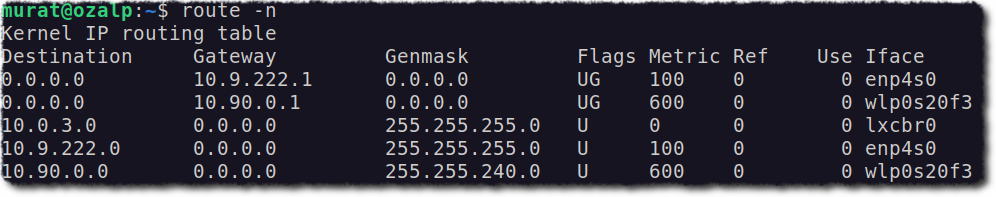
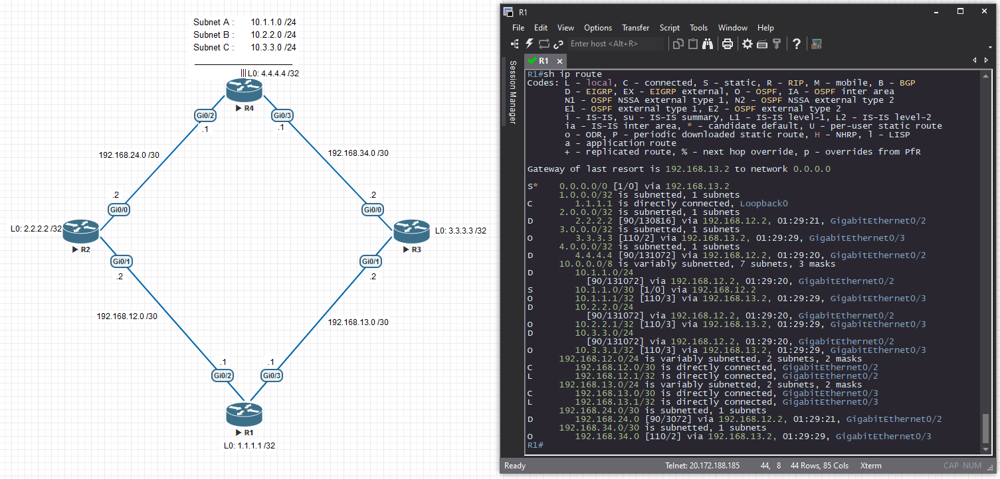
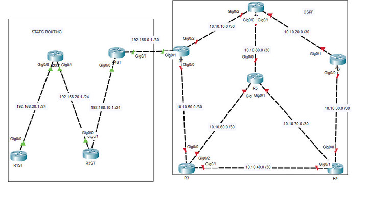

# IP Yönlendirme

IP’nin yönlendirilebilir olması protokolün en güçlü özelliğidir. Çok
sayıda iletişim protokolü mevcut olmasına rağmen IP’nin
yönlendirilebilir esnek yapısı internetin temel dili olmasını
sağlamıştır. Yönlendirme işlemini "Yönlendirici(Router)" yapar.

**Yönlendirme Tablosunda**

1.  Kaynak
2.  Hedef (IP ve Maske)
3.  Ağ Geçidi
4.  Ara Birim (Interface)
5.  Ölçüt (Metrik)

*Linux'ta yönlendirme tablosu. Hem kablolu hem de kablosuz bağlantı aktif*

  
*Görsel kaynağı: <https://willgrana.com/posts/reading-cisco-ios-routing-table/>*

Yönlendirme tablosunda birbirini kapsayan kurallar var ise bunlar
küçükten büyüğe sıra ie değerlendirilir.

## STATİK YÖNLENDİRME

Ağ yöneticisi tarafından elle sabit olarak yazılır.Genellikle
yönlendiricisi ve yönlendirme işlemi çok fazla olmayan ağlarda
kullanılır.Yönlendirme tablolarının güncellemesi ağdaki fiziksel
değişikliklere göre yeniden elle yapılmalıdır.

## DİNAMİK YÖNLENDİRME

Yönlendirme algoritmaları tarafından hesaplanarak bulunur. Ağ yöneticisi
tarafından önceden bazı filtreler ve tanımlamalar yapılmalıdır. Ağda
değişiklik olduğunda yollar otomatik olarak düzeltilir. En yaygın
yönlendirme algoritmaları OSPF, BGP, RIP şeklindedir.

  
*Görsel kaynağı: <https://learningnetwork.cisco.com/s/question/0D53i00000S8yMLCAZ/static-and-dynamic-routing>*

