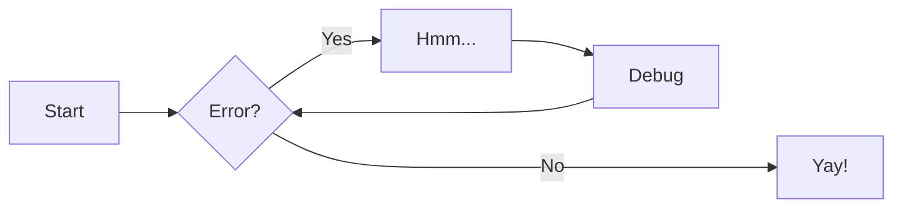

# Material for MkDocs
[https://squidfunk.github.io/mkdocs-material/reference/](https://squidfunk.github.io/mkdocs-material/reference/)  

# Dipnot ve sözlük kullanımı
*[bps]: bit per second (saniyedeki bit sayısı)
*[RF]: Yüksek frekanslı dalgaya radyo frekans denilir. Bu dalga RF kısaltmasıyla gösterilir
[^1]: [OSI -Open Systems Interconnection- modeli ISO tarafından geliştirilmiştir.](https://tr.wikipedia.org/wiki/OSI_modeli)

IP, bps,  RF ve OSI[^1] gibi ifadeler sözlük şeklinde kullanılabilir. BSEU MF.

# Görsel kullanımı
Boyut kullanılabiliyor. Başlık ta kullanılabiliyor ama VSCode'da görünmüyor, yazımı da pek güzel değil.

## Boyut kullanma
{width="200"}  
*Görsel kaynağı: https://telecom.samm.com/history-of-ethernet-lan-cables-categories*

## Başlık kullanımı
<figure markdown="span">
  { width="200" }
  <figcaption>Görsel kaynağı: https://www.electricalvolt.com/how-to-crimp-rj45-connector/</figcaption>
</figure>

# Açıklamalar
!!! warning "CAT-1, CAT-2, CAT-3"
    Telefon hatlarında kullanılır, ağlarda kullanılmaz.  

# Mermaid diyagram
