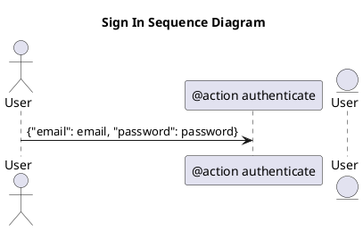
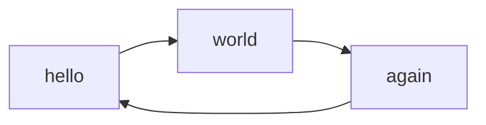
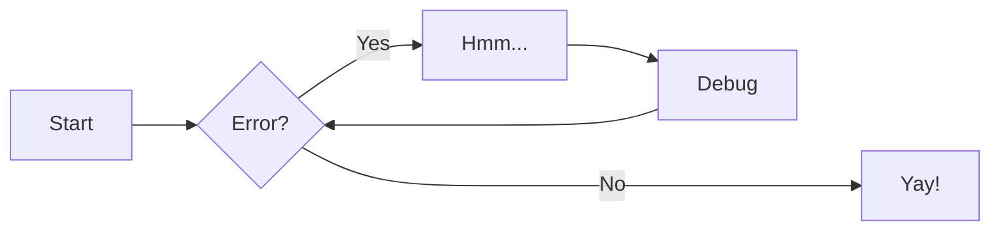

# Deneme Tahtası
## Material for MkDocs
[https://squidfunk.github.io/mkdocs-material/reference/](https://squidfunk.github.io/mkdocs-material/reference/)  

## Callouts eklentisi
[https://squidfunk.github.io/mkdocs-material/reference/admonitions/#classic-admonitions-docsstylesheetsextracss](https://squidfunk.github.io/mkdocs-material/reference/admonitions/#classic-admonitions-docsstylesheetsextracss)

!!! warning "Writing custom titles"
    Lorem ipsum dolor sit amet, consectetur adipiscing elit. Nulla et euismod
    nulla. Curabitur feugiat, tortor non consequat finibus, justo purus auctor
    massa, nec semper lorem quam in massa.

!!! info "Writing custom titles"
    Lorem ipsum dolor sit amet, consectetur adipiscing elit. Nulla et euismod
    nulla. Curabitur feugiat, tortor non consequat finibus, justo purus auctor
    massa, nec semper lorem quam in massa.

??? note

    Lorem ipsum dolor sit amet, consectetur adipiscing elit. Nulla et euismod
    nulla. Curabitur feugiat, tortor non consequat finibus, justo purus auctor
    massa, nec semper lorem quam in massa.

## PlantUML Grafiği
```puml
Alice -> Bob
```



## Mermaid Grafiği




## Formül denemesi
math kütüphanesi

### Satır içi formül
When $a \ne 0$, there are two solutions to $(ax^2 + bx + c = 0)$ and they are

### Satır arası formül
$$ x = {-b \pm \sqrt{b^2-4ac} \over 2a} $$

## Dipnot ve sözlük kullanımı
*[bps]: bit per second (saniyedeki bit sayısı)
*[RF]: Yüksek frekanslı dalgaya radyo frekans denilir. Bu dalga RF kısaltmasıyla gösterilir
[^1]: [OSI -Open Systems Interconnection- modeli ISO tarafından geliştirilmiştir.](https://tr.wikipedia.org/wiki/OSI_modeli)

IP, bps,  RF ve OSI[^1] gibi ifadeler sözlük şeklinde kullanılabilir. BSEU MF.

## Görsel kullanımı
Boyut kullanılabiliyor. Başlık ta kullanılabiliyor ama VSCode'da görünmüyor, yazımı da pek güzel değil.

### Görselde boyut kullanma
{width="300"}  
*Görsel kaynağı: https://telecom.samm.com/history-of-ethernet-lan-cables-categories*

### Görselde başlık metni kullanımı
<figure markdown="span">
  
  <figcaption>Görsel kaynağı: https://www.electricalvolt.com/how-to-crimp-rj45-connector/</figcaption>
</figure>

# Son başlık.
..