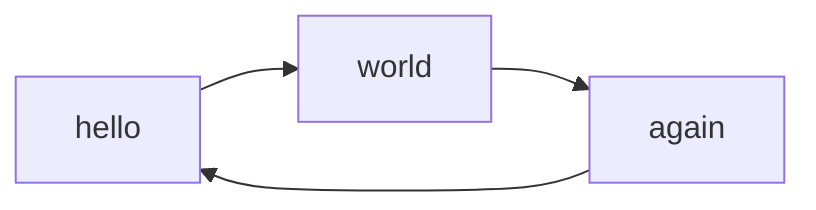

# Üst seviye başlık: import edilen dosya
...

## Callouts eklentisi

!!! TIP: **Writing custom titles.**
	Lorem ipsum dolor sit amet, consectetur adipiscing elit. Nulla et euismod
	nulla. Curabitur feugiat, tortor non consequat finibus, justo purus auctor
	massa, nec semper lorem quam in massa.

>? NOTE: Lorem ipsum dolor sit amet, consectetur adipiscing elit. Nulla et euismod
> nulla. Curabitur feugiat, tortor non consequat finibus, justo purus auctor
> massa, nec semper lorem quam in massa.

> NOTE: Lorem ipsum dolor sit amet, consectetur adipiscing elit. Nulla et euismod
> nulla. Curabitur feugiat, tortor non consequat finibus, justo purus auctor
> massa, nec semper lorem quam in massa.

## PlantUML Grafiği
::uml:: format="png" classes="uml myDiagram" alt="My super diagram placeholder" title="My super diagram" width="300px" height="300px"
  Goofy ->  MickeyMouse: calls
  Goofy <-- MickeyMouse: responds
::end-uml::

## Mermaid Grafiği

## Formül denemesi
math kütüphanesi
### Satır içi formül
When $a \ne 0$, there are two solutions to $(ax^2 + bx + c = 0)$ and they are

### Satır arası formül
$$ x = {-b \pm \sqrt{b^2-4ac} \over 2a} $$

...
