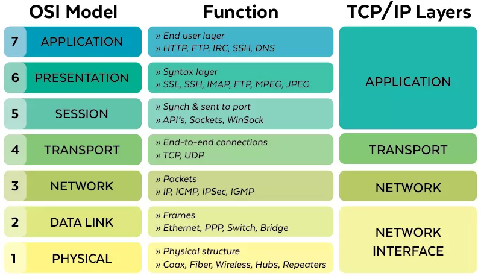

# 03. OSI MODELİ (OSI KATMANLARI)

Bir bilgisayardan gönderilen bir bilginin diğer bilgisayara nasıl
ulaştığını anlatmak için tasarlanmıştır. İletişimi 7 katmanlı mimarı ile
tanımlar. Ağ elemanlarının nasıl çalıştığını ve verinin iletimi
sırasında hangi işlemlerden geçtiğini kavramak için kullanılan
rehberdir. OSI Katmanlarının mantığını anlamak ağları planlamak, ağ
üzerinden çalışan program yazmak ve ağ sorunlarını çözmek için
önemlidir.

## Katmanlar

1.  [ Fiziksel (Physical)](#subsubsec:fiziksel_katmanlar)

2.  [Veri Bağı (Data link)](#subsubsec:veri_bagi_katmani)

3.  [Ağ (IP)](#subsubsec:ag_katmani)

4.  [Taşıma (Transport)](#subsubsec:tasima_katmani)

5.  Oturum (Session)

6.  Sunum (Presentation)

7.  [Uygulama (Application)](#subsubsec:tasima_katmani)

*Görsel kaynağı: https://planetechusa.com/layer-2-vs-layer-3-switches/*

|  | 
|:--:| 
| *Görsel kaynağı: *https://planetechusa.com/layer-2-vs-layer-3-switches/ |

### Fiziksel Katman

Haberleşme kanalının elektriksel ve mekanik olarak tanımlandığı
katmandır. Bir uçtan gönderilen sinyalin karşı uca iletilmesinden
sorumludur. Sayısal haberleşmede en küçük birim bit olduğundan bu
katmanın hızı **(bps) (b/s) bit/saniye** cinsindendir. Birinci katman
donanımları:

1.  Bakır ve fiber optik kablolar

2.  RF (Antenler)

3.  Sinyali(işareti) elektrik olarak yükselten ve çoklayan HUB cihazları

4.  Kablosuz iletişimde kullanılan hava

### Veri Bağı Katmanı

Verinin fiziksel ortamdan güvenli bir şekilde taşınmasından sorumlu olan
katmandır. Kaynaktan çıkan verilerin(bitler) hedefe ulaşan verilerle
aynı olup olmadığını sınayan sistemler kullanılır. En çok kullanılan
hata bulma algoritmaları **eşlik biti (parity check)** ve **CRC
algoritmasıdır**. Verinin doğru olup olmadığına bakmaz, sadece
sağlamlığını kontrol eder. Bu katmanda üst katmandan gelen veriler
çerçeve (frame) adı verilen paketleme işlemini tabi tutulur. Kapsülleme
de denir. Birbirine doğrudan bağlı ağ cihazlarının aynı kapsülleme
yöntemini (ikinci katman protokolünü) kullanması gerekir.

| Kaynak | Veri | Hata Denetimi |
|:------:|:----:|:-------------:|

Kapsülleme

<figure>

<figcaption aria-hidden="true">Kapsülleme</figcaption>
</figure>

https://afteracademy.com/blog/what-is-data-encapsulation-and-de-encapsulation-in-networking/

<figure>

<figcaption aria-hidden="true">Kapsülleme (katmanlar) -
https://afteracademy.com/blog/what-is-data-encapsulation-and-de-encapsulation-in-networking/</figcaption>
</figure>

<figure>

<figcaption aria-hidden="true">Ethernet Çerçevesi Başlığı</figcaption>
</figure>

### Günümüzde en yaygın ikinci katman protokolleri

**Yerel ağda (LAN)** : Ethernet  
**Uzak ağlarda (WAN)** : AIM, PPP, Frame, Relay, Metroethernet

## Anahtarlama

1.  **Devre Anahtarlama**: Veri aktarımı, fiziksel değişiklikle yapılır.

2.  **Paket Anahtarlama**: Veri aktarımı, her bir veri paketi için
    hesaplanarak, yazılımsal olarak yapılır.

Ethernet protokolünde kaynak ve hedef adresleri olarak MAC adresi
(fiziksel adresi) kullanılır. Çakışmaları engellemek için aynı ağda iki
MAC adresi olmamalıdır.

Anahtarlar (switch) bu katmanda çalışır. Anahtarlar portlarına bağlı
olan cihazların MAC adreslerini bilmek zorundadır (otomatik öğrenir). Bu
şekilde iki farklı portu arasındaki trafiği diğer cihazlar görmeden
aktarabilirler. **HUB’lardan en önemli farkı budur**.

### Ağ Katmanı (IP)

İnternet dünyanın farklı yerlerindeki ağlar üzerinden erişebilir kiler
katman budur. Kaynak ve hedef olarak IP[^1] adresi kullanılır. IP
yönlendirilebilir bir protokol olduğundan her türlü veri aağı üzerinden
haberleşmeye olarak sağlanır. Bu katman en önemli görevi yönlendirme
işlemidir. Yönlendirme işlemi birden fazla ağ arayüzüne (network
interface) sahip olan yönlendirici(router) adı verilen cihazlar
tarafından yapılır. IP internetin temel protokolüdür. Yani bir PC
internete bağlanacaksa IP’yi mutlaka biliyor olmalıdır. Bazı anahtarlar
üçüncü katmanda da çalışabilmektedir.

<figure>

<figcaption aria-hidden="true">AĞ Katmanı</figcaption>
</figure>

1.  **A,B,C** aynı ağdadır. Birbirleriyle MAC adresleriyle haberleşir
    (2. katman).

2.  **X,Y,Z** aynı ağdadır. Birbirleriyle MAC adresleriyle haberleşir
    (2. katman).

1.  **En küçük birimine paketleme denir.**

### Taşıma Katmanı

İnternette IP üzerinde kullanılan 2 tane 4. katman protokolü vardır.
Bunlar **TCP** ve **UDP** dir. Bu katman uygulama programları
için seri iletişim kanalları kuran katmandır. Bu kanallar port adı
verilen servis numaralarıyla kurulur.

**TCP**[^2]: Bağlantı temelli bir protokoldür. Trafik başlamadan önce
karşıdaki uca müsait olup olmadığı sorulur. Bu yönüyle telefon
görüşmesine benzer.

**UDP**[^3]: Bağlantı temelli değildir. Trafik doğrudan başlatıldığı
için paketlerin iletimi garanti edilmez. SMS gönderimine benzetilebilir.
Özellikle gerçek zamanlı görüntü ve ses taşıma uygulamalarında
elverişlidir. **TCP**’ye göre daha **hızlıdır**.

**Örnek**: 3 way handshaking - 3 aşamalı el sıkışma

<figure>

<figcaption aria-hidden="true">TCP Protokolü</figcaption>
</figure>

Oturum açıldıktan sonra ilk olacak - Veri kaç parçada gönderilecek  
1GB filmi  
80 segmentte ⇒ (1180 2180 .... 80/80) bunlar paketlenir.

**TCP**’de sadece yavaşlama olacak görürüz. En önemli avantajı budur.

<figure>

<figcaption aria-hidden="true">UDP Protokolü</figcaption>
</figure>

**UDP**’nin avantajı hızlı **TCP**’ye göre. Dezavantajı ise güvensiz.

**Örneğin**: İnternetten radyo dinleyeceğiz bunu **UDP** ile dinlemek
zorundayız, çünkü GB belli değil. **TCP**’de önemlidir.

Dördüncü katmanın bir başka görevi de üst katmanlardan gelen veriyi
bölümleyerek daha küçük parçalara ayırmaktır. Bu parçalara **segment**
denir.

|            TCP             |    UDP     |     |
|:--------------------------:|:----------:|:---:|
| Güvenli ( oturum temelli ) | Oturum yok |     |
|           Yavaş            |   Hızlı    |     |

TCP vs UDP

### Uygulama Seviyesi Katmanlar

Aslında uygulama seviyesi sadece 7. katmandır. Ancak 5 ve 6 yaygın
kullanılmadığından ve farklı uygulamalar arasında standart olmadığından
bu derste üçüncu tek başlkta inceliyoruz.

Uygulama programları genellikle 7. katmanda ulaşmakta ve genellikle
doğruden 4. katman ile iletişime geçmektedir.

**TELNET**: Ağlarda yönetim ve kontrol
amaclı kullanılır. Ağ cihazlarının genellikle tamamı **telnet** ile
yönetimi destekler. 2 cihaz arasında 4. katmanda bağlantı
(erişebilirlik) kontrolü yapmak için **telnet** kullanılır.

\*\* **Port tarama uygulamaları**  
4. katmanda açık olan **TCP/UDP**
portlarını tarar.

**nmap**: **TCP** yada **UDP**’ye kadar
**0-65536**’ye kadar port taraması yapar.

| **OBS**               | **Uzak masaüstu**       | **nmap -\> OS dedikten** |
|:----------------------|:------------------------|:-------------------------|
| Port tarama           | TCP 3389                | obs.bilecik.edu.tr       |
| 79.123.244.212 -\> IP | 79.123.244.212 start IP | cevaplar                 |
| TCP 80 open           | 79.123.244.212 end IP   | tahmin                   |

Örnek

