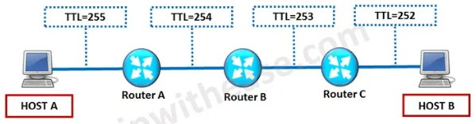

# Temel Kavramlar

### Aktarım Verimliliği

$$ \mathtt{Aktarım \ Verimliliği = {Veri \over (Veri + TCP/UDP \ baslığı + IP \ baslığı + Ethernet \ baslığı)}} $$

Bu denkleme göre; bir seferde gönderilen veri bloğu ne kadar büyürse, verim o kadar artar.

**MTU:** _Maximum Transmission Unit_. Bir seferde gönderilebilecek maksimum veri miktarını belirler. Ethernet ağlarında MTU değeri varsayılan olarak **1500
bayt/kapsül**

**TTL:** _Time to Live_. Paketlerin Ağda sonsuz kadar dolaşmaması için kullanılan yaşam ömrü süresidir. Başlangıç TTL değeri sistemden sisteme değişir. 256, 128 veya 64 olabilmektedir.

*Görsel kaynağı: https://ipwithease.com/what-is-time-to-live-ttl-in-networking/*

Bir paket, **hop noktaları** arasında her aktarıldığında **TTL değeri 1 azalır**.

*Zamana Karşı filmindeki insanların TTL değeri*
## Band Genişliği (Bandwidth)

Haberleşme kanalının veya iletim ortamının kapasitesini ifade etmek için
kullanılır. Analog sinayallerde birini **hertz (hz)** iken digital sistemlerde
**bps (b/s)**.  
bir haberleşme sistemi, gönderirici, alıcı ve iletim ortamından oluşur.
İletim kapasitesi en büyük olan bütün sistemin bant genişliği belirler.

Örnek:

<figure>

<figcaption aria-hidden="true">Bant Genişliği</figcaption>
</figure>

**Soru**

1.  240 mb büyüklüğündeki bir MP3 dosyası bir sistemde 4dk’da
    aktarılıyor. Bu sistemin aktarım kapasitesini (bant genişliğini)
    bulunuz.

2.  MP3 yerine MPG olsaydı ne olurdu?

**Çözüm**

Bw=?

1.  4dk 240 mb =\> saniyede 1mb = 8mb/s

2.  Değişim olmaz...

## Temel Band (Base Band)

İletim ortamında tek bir frekans bandı kullanılır. Böylece teorik olarak
iletim ortamının tüm kapasitesi tek bir kanal için kullanılır.  
**Örneğin**: Ethernette bu band kullanır.

## Geniş Band (Brood Band)

İletim ortamında birden fazla frekans bandı kullanılır. bulunur. Basit
bir frekans band filtresi sayesinde kanallar ayrıştırılabilir. Telefon
hattından aynı anda ses verinin taşınması buna örnektir.

## Paralel ve Seri İletişim

Paralel iletişimde byte düzenyinde iletişim sağlanır. İki uç arasında en
az 8 tane fiziksel iletim ortamı olmalıdır. Band genişliği teorik olarak
8 hat daha fazla olduğu düşünülebilir. Ancak hem maliyet hem protokol
tercihi hem de kullanılan topoloji gibi ektenler bu konuda etkilidir.

## Haberleşme Kanalı Modlari

1.  ** Simplex Kanal**: Televizyon ve
    radyo gibi yayının tek taraflı olarak yapıldığı kanallardır.

2.  ** Half-dubleks Kanal**: Çıft yönlu
    iletişim vardır. Ancak aynı anda sadece bir taraf veri gönderebilir.
    Örnek olarak **telsiz**.

3.  ** Full-dubleks Kanal**: İki uc
    arasında iki tane simplex kanal vardır. Böylece aynı anda iki taraf
    veri gönderebilir ve alabilir. Örnek telefon görüşmeleri.

4.  Günümüzde tüm bilgisayar ağları **Full-dubleks**’dir.
