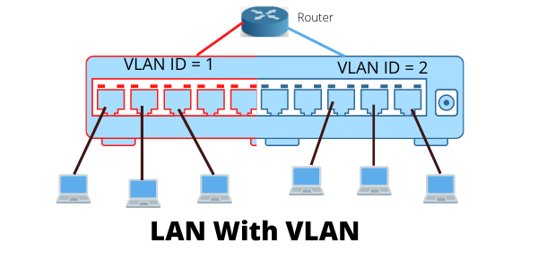
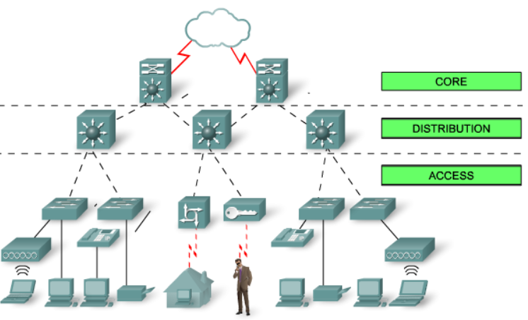

# Yerel Ağlar - LAN/VLAN

Yerel ağlarda haberleşmeyi sağlayan ethernet çerçevesinde(frame) 48
bitlik adres kullanılır. MAC adresi 16’lık sayı sisteminde 12 tane
karakter ile gösterilir.

|        |                         |
|:-------|:------------------------|
| 16 bit | → 24 0000    |
| 48     | → 16 tane 24 |

İlk 6 karakterlik ilk 24 bit üretici kodunun son 6 karakter ise seri
numarasını belirtir.Bir üretici aynı MAC adresiini birden fazla karar
vermez.Dolyısıyla MAC adresleri dünyada tektir. \* Birden fazla aynı MAC
adresi aynı ağ üzerinde(LAN,VLAN vb) olmamalıdır.

|                                              |                                               |
|:---------------------------------------------|:----------------------------------------------|
| **Windows**                                  | → CMD                                         |
|                                              | → ipconfig                                    |
|                                              | → getmac                                      |
| **Linux** | → ifconfig |

**Adres Çözümleme** Ağdaki Bilgisayarlar başlangıçta diğer
bilgisayarların mac adreslerini bilemez. MAC adreslerini öğrenmek için;

## ARP(Adress Resulotion Protocol) (Adres Cözümleme Protokolü)

Bu protokol ikinci katmanda çalışır.Ağdaki Bilgisayarların MAC
adreslerini öğrenmek ve bu cihazdaki ARP tablosunu güncellemek en temel
görevdir.

SORU\*\* ARP tablosunda;statik kayıt ne işe yarar? 1970 de bilgisayar
ağları tasarlanırken gelişimi hakkında kesin bilgi olmadığında
statik(önü açık ) bırakılmıştır.

## YAYIN ADRESİ(BROADCAST ADDRESS)

Tüm yerel ağı temsil eden tek bir adrestir .Bu adrese gönderilen paket
ağdaki tüm cihalara aynı anda uaştırılır.İkinci veya üçüncü katmanda
yayın mesajı gelir.Yayın mesajlarında ne gibi fark vardır?

<figure>

<figcaption aria-hidden="true">fibersonlandırma</figcaption>
</figure>

  
İkinci katmanda yayın adresi göndermek için çerçevedeki hedef mac
adresindeki kısmında tüm bitler 1 yapılır. Dolayısıyla hedef adresi
FF:FF:FF:FF:FF:FF yapılır.Ağa yeni bağlanan her cihaz kendi mac ve IP
adreslerini içeren bir yayın mesajı gönderir. Her bilgisayarda ve
anahtarda aynı ağdaki cihazlarla tutulan IP ve MAC adreslerinin
tablosuna "ARP TABLOSU" denir. ARP Tablosu dinamik olarak
güncellenir,ancak istenirse elle düzenleme ya da statik kayıt işlemi
yapılabilir.

### YAYIN ALANI

Bilgisayarların doğrudan mac adresleriyle haberleştikleri alandır.Bir
yayın paketi gönderildiğinde bunu alabilen tüm cihazlar aynı yayın
alanındadır. Bir bilgisayr kendi yayın alanında olmayan başka bir
bilgisayarla haberleşmek için "ağ geçidinden" geçmek zorundadır.

## ÇARPIŞMA ALANI

Bir yayın alanı içerisinde bir veya birden fazla çarpışma alanı
bulunur.Aynı çarpışma alanındaki bilgisayarlar birbirine gelen her
paketi görürler,ancak sadece kendi mac adreslerine gelen her paketi
görürler. Çarpışma alanı aynı anda bir pc tarafından kullanılabilir.  
İki PC aynı anda paket göndermek isterse çarpışma(collision)
oluşur.Adını burdan alır.  

<figure>

<figcaption aria-hidden="true">Soru1</figcaption>
</figure>

1)Kaç tane yayın alanı vardır? 2  
2)Kaç tane çarpışma alanı vardır? 3  
3)Her çarpışma alanında kaç tane bilgisayar vardır?  
4)Her yayın alanında kaç tane bilgisayar vardır?  
Birinci yayın alanında 3 tane  
İkinci yayın alanında 8 tane  
\*YAYIN ALANI:mecburen ağ geçidi kullanılır.  
\*ÇARPIŞMA ALANI:Birbirlerinin verisini görecekler.

<figure>

<figcaption aria-hidden="true">Soru2</figcaption>
</figure>

A ile B aynı anda paket gönderebilir mi? Yaçarpışma olur ya da sıra  
B ile C aynı anda paket gönderebilir mi?  
B ile C aynı Pc gönderirse olur,ancak farklı olursa aralarındaki
topolojileri bilmediğimiz için bilemeyiz.  
C yayın mesajı gönderdiğinde tüm pc’lere gider mi?  
Evet tüm Pclere gider.  
B ile C aynı arasındaki trafiği F görür mü?  
Normal zamanda göremez.Ancak örneğin aynalama gibi işlemerde
görebilir.  
Anahtar üzerinde pc’lerin haricinde dış dünya ile iletişim kurmak için
bağlantı yapılan porta "upink" poru denir. Anahtarın bilgisayara
bağlanan normal portlarına(bakır portlara 45 port) "giriş portu"
denir.Genel olarak 100mb/s-1000mb/s olurken "uplink portları" genellikle
daha kapasiteli olur. Anahtarları birbirinden ayıran bir diğer özellikte
"demir gücü kapasitesi"anahtarın aynı anda çevirebileceği trafik
miktarına "switchfabric" ya da "through put"denir.

### AĞ GEÇİTLERİ(GATEWAY)
Ağ geçidi tanımı yönlendirme,protokol çevirme veya güvenlik
uygulaması gibi işlemleri yapan tüm cihazları kapsar.Sıradan bir PC
,3.katman(L3) anahtar,yönlendirici veya özel üretilmiş donanım
olabilir.
Ağ geçitleri üzerindeki ağ arayüzüne(interface) bağlı olarak
ethernet,Frame Relay,ATM,PPPoE gibi protokollerin hepsinin
kullanılabilme özelliğine sahip olduğundan bazı kaynaklardan
protokol çevirici olarak adlandırılır.

Önceden bahsedildği gibi anahtarlar çarpışma alanına geçemezler.Bu
nedenle kablolara göre daha fazla tercih edilir. Ancak anahtarlar da
yayın trafiğini geçebilirer.Bünyesinde çok fazla anahtar bulunan yerel
ağlar,yayın paketlerin çokluğu ağı hantallaştırır.Bu nedenle LAN’ları
birbirinden çok alt ağa bölmek performansı arttıracaktır. **Örnek Yayın
Mesajları**  
\*IPV4 İIPV6 mesajları  
\*Komşuluk mesajları  
\*Donanım keşif mesajları  
\*Ip alma (DHCP)mesajları  
\*Virüs gibi kötü yazılımlar  

## Alt Ağa Bölmenin temel olarak iki yolu vardır

### Klasik Yöntem (Fiziksel Ağ Geçidi Kullanma)

Klasik yöntemde herbir ağ için bir ağ geçidi kullanılması
zorunludr.Dolayısıyla ciihazların,bağlantıları ve topolojilerin
sınırları en önemli kısıtlardır.Bir vlan yapısında ise fiziksel bir
müdahale olmadan hatta uzaktan bağlanarak ağ istenilen şekilde
özelleştirilebilir. **Sanal Ağlar(VLAN)**  
yönlendirici,Kablosuz Ap,Güvenlik Duvarı,PC vb.

<figure>

<figcaption aria-hidden="true">VLAN</figcaption>
</figure>

Aynı ağ her yerde kullanılabiliyor.  
Geleneksel yapıda ağları birbirinden ayrılması için ağ geçidi
kullanılır  
Bir anahtarda çok sayıda ağ(VLAN) kullanabiliyoruz.

## Ağları bölmenin faydaları
1. **İşletme Kolaylığı**: Ağlar küçük olduğunda sorunu çözmek
    kolaylaşır. Ağ isimleri, IP grupları ve kullanım yerleri eşleştirilerek hiyerarşik sistemler oluşturulabilir. 
2. **PC sayısını azaltmak**: Her bir ağdaki pc sayısını azaltarak yayın
    alanını daraltmak, fazlalık yayın mesajlarını azaltmak ve performansı arttırmak
3. **Güvenlik**: Birbirine erişimi kısıtlamaması gereken ağlar arasında
    erişim denetim listeleri (Access Control List ~ ACL) oluşturularak
    erişim kısıtlanabilir.
---

**Esneklik**: Eğer ağı VLAN ile bölersek; farklı coğrafyadaki bilgisayarlar aynı VLAN'da olabilir ya da aynı anahtar üzerinde birden fazla farklı VLAN olabilir.

<figure>

<figcaption aria-hidden="true">LAN-VLAN</figcaption>
</figure>

# VLAN ANAHTARLAR

Üzerinde sanal ağlar tanımlanabilen anahtarlardır.Sıradan anahtarlarda
üstün olmasının en önemli sebebi ayarlanabilir olmasıdır. Bu nedenle
yönetilebilir anahtarlar da denmektedir.Vlan anahtarın üzerindeki
portlar gruplandırılarak birden çok sanal ağ oluşturulabilir.
  
*Görsel kaynağı: https://www.practicalnetworking.net/stand-alone/routing-between-vlans/*

Her bir sanal anahtar ayrı bir ağ gibi çalıştırılabilir.Bu sanal ağlara "VLAN" denir.Her bir vlan’ın kendine özel Vlan Id isminde bir tanımlayıcı numarası olur. Anahtarları fizikse portları Vlan ID’leri ile eşleştirilerek ağlar düzenlenir.Aynı vlan numrasına sahip portlar aynı sanal ağa aittir.  

Bazı durumlarda VLAN yapılandırılması portlardan ve fiziksel
bağlantılardan bağımsız olarak yapılabilir.Örneğin pc’nin MAC
adreslerine göre ya da kullanıcı kimlik doğrulama yöntemine göre
(parola,parmak izi ) Vlan ataması yapılabilir.  
Vlan anahtarlar kullanıldığında birden fazla sanal ağı oluşturursa bu
alt ağlar arasında trafiğin yönlendirilmesi gerekmektedir. Bu yönlendirme
işlemi anahtarın kendi üzerinde veya ayrı bir yönlendirici cihazla yapmak
mümkündür.
  
*Görsel kaynağı: https://www.qsfptek.com/qt-news/how-to-choose-best-aggregation-switch.html*

Anahtar üzerinde yönlendirme yapılacaksa 3 katmanda(L3) çakıştırılacak
bir anahtar kullanılmalıdır.
  
*Görsel kaynağı: https://planetechusa.com/layer-2-vs-layer-3-switches

## IEEE 8021.q VLAN protokolü
**Dot1q** olarak ta bilinir. Ethernet protokolü ilk tasarlandığında VLAN ihtiyacı yoktu. 1998 yılında yayınlanan 802.1q protokolü ile Ethernet protokolü VLAN farkındalığı kazandı.
  
*Görsel kaynağı: https://www.ictshore.com/free-ccna-course/vlans-configuration-cisco-switch/*

**trunk (tagged) port:** Anahtarın herhangi bir portundan birden fazla VLAN taşınması gerekiyorsa o port trunk olarak yapılandırılmalıdır. Aynı zamanda bu bağlantıya da "trunk" denir. Genellikle iki anahtar arasında kullanılır ancak ihtiyaca göre 1 bilgisayara bile trunk bağlantı verilebilir. Anahtarlar, bu portta gelen-giden trafiklere bakarak başlık bilgisindeki trafiğin ilgili VLAN'a gitmesini sağlar.

**acces (untagged) port:** Bu portta VLAN etiketleri olmaz. Anahtar üzerinde config yapılarak, bu porttan gelen-giden tüm trafiğin belirli bir VLAN'a gitmesi sağlanır.
  
*Görsel kaynağı: https://networklessons.com/switching/802-1q-encapsulation-explained*

Cisco firması `trunk/access` sözcüklerini kullanırken diğer üreticiler genellikle `tagged/untagged` sözcüklerini tercih etmektedir.

# ANAHTAR KULLANIM MİMARİSİ

  
*Görsel kaynağı: https://blog.router-switch.com/2014/04/network-design-with-examples-core-and-distribution/*

1. **OMURGA(CORE)**  
Üçüncü katman veya daha üstü anahtar kullanılır.Genellikle tüm Vlanlar
burda oluşturulur.Ağın tüm yönlendirme yükü bunun üzerindedir.Bu nedenle
genellikle yedekli kullanır.Performansı çok fazladır.Binalar arası
bağlantıyı sağlamak için kullanılır.Bu nedenle çok sayıda fiberoptik
port sergilerler.Modüler yapıdadırlar,yani port sayıları ve türleri
modüler halinde takılıp çıkartılabilir.Modülerin takıldığı yere "şase"
denir.Fiziksel olarak çok yer kaplarlar ve pahalıdırlar.  
  
*Görsel kaynağı: https://thenetworkinstallers.com/blog/fiber-optic-installation-process/*

2. **Dağıtım(Distrubution)Katmanı**  
Omurga anahtarında bağlı olan ve binaların içerisinde küçük bir omurga
gibi düşünebileceğimiz anahtarlardır.Omurga anahtarına göre daha
ucuzdur.L2 veya L3 olabilir.  

3. **KENAR**  
Son kullanıcı cihazlarının bağlandığı anahtarlardır.Bu nedenle
özel görevleri olabilir.  
İhtiyaca göre :  
802.1x(Kimlik Doğrulama)  
PoE(802.3aaf) Enerji göndermek için kullanılır.  
Captive Portal

  
*Görsel kaynağı: https://blog.router-switch.com/2014/04/network-design-with-examples-core-and-distribution/*

**Örnek:**  
20 portlu bir VLAN anahtar 4 portlu bir ağ geçidine
bağlanabiliyorAşağıdaki durumları yorumlayınız. 

1)Her portun port sayısı 5’er tanedir.  
Böyle bir zorunluluk yoktu.̊  
2)Bir valan anahtar üzerine doğrudan bağlanacak PC sayısı 16’dır  
16 tane de olabilir daha fazla da olabilir.  
3)Her vlana atanmış portlar ardışık olmak zorundadır  
Öyle bir şey yok.Esneklik özelliği vardır .
